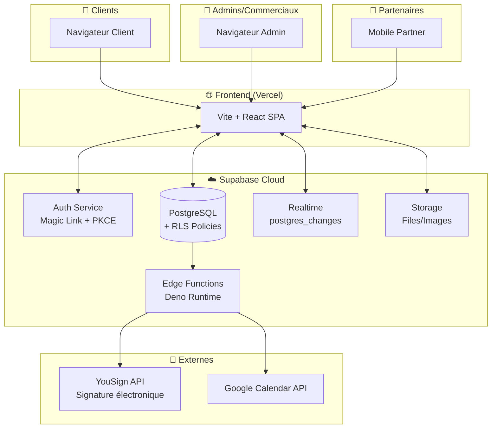
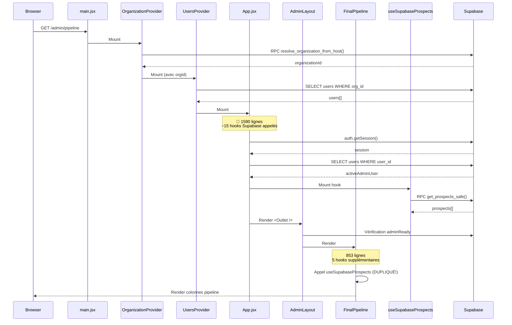
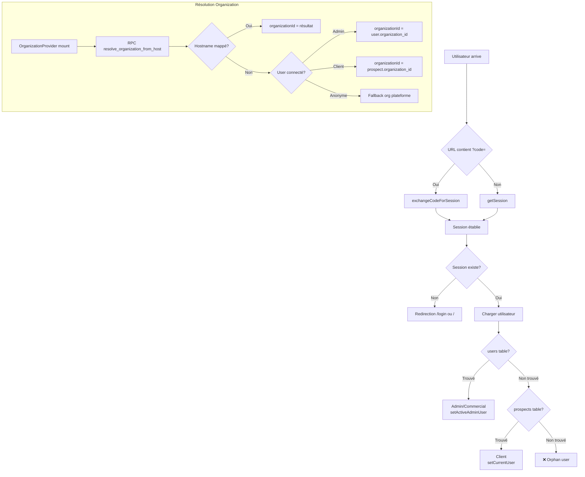
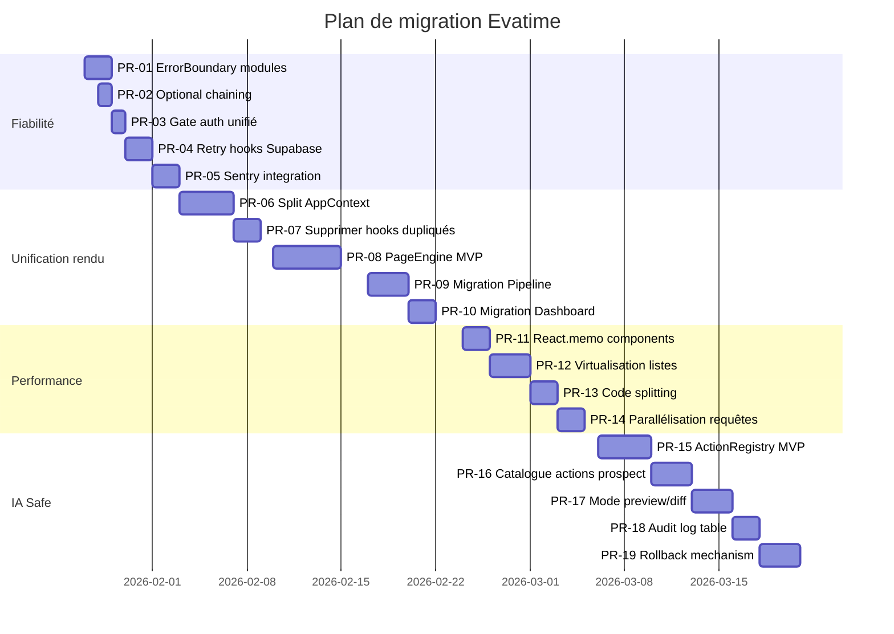

# 🏗️ AUDIT ARCHITECTURE EVATIME — LOCASUN APP

> **Document rédigé par**: Principal Engineer / Architecte Logiciel Senior  
> **Date**: 24 janvier 2026  
> **Version**: 1.0  
> **Objectif**: Scaler proprement pour ~20 000 users, devenir "le logiciel le plus fluide du monde"

---

## Table des matières

- [A) Carte du système](#a-carte-du-système)
- [B) Analyse "pages blanches"](#b-analyse-pages-blanches-evidence-based)
- [C) Analyse performance](#c-analyse-performance-front--back)
- [D) Architecture cible "wow"](#d-architecture-cible-wow-proposée)
- [E) Couche IA orchestratrice](#e-couche-ia-orchestratrice-concrète)
- [F) Plan d'exécution incrémental](#f-plan-dexécution-incrémental-pr-plan)

---

# A) Carte du système

## Stack Technique

| Couche | Technologie | Fichiers clés |
|--------|-------------|---------------|
| **Frontend** | React 18.2 + Vite 4.4 | `src/App.jsx` (1590 lignes), `src/main.jsx` |
| **Styling** | Tailwind CSS 3.3 + Radix UI | `tailwind.config.js`, `src/components/ui/*` |
| **State** | Context API (`AppContext`) + 31 hooks Supabase | `src/hooks/useSupabase*.js` |
| **Routing** | react-router-dom 6.16 (BrowserRouter) | `src/App.jsx` lignes 1480-1590 |
| **Backend/BaaS** | Supabase (PostgreSQL + Auth + Realtime + Edge Functions) | `supabase/schema.sql` (1597 lignes), `supabase/functions/*` |
| **Animations** | Framer Motion 10.16 | Utilisé dans `FinalPipeline.jsx`, `Dashboard.jsx` |
| **Drag & Drop** | @dnd-kit/core + @hello-pangea/dnd | `Agenda.jsx`, `FinalPipeline.jsx` |
| **PDF** | pdf-lib, jspdf, pdfjs-dist | `src/lib/contractPdfGenerator.js` |
| **Infra** | Vercel (frontend) + Supabase Cloud | `vercel.json` |

## Monorepo: NON

Structure **mono-projet** frontend avec backend "serverless" (Supabase Edge Functions).

```
locasun-app/
├── src/                    # Frontend React (143 fichiers JS/JSX)
│   ├── App.jsx             # 🚨 1590 lignes - Point d'entrée principal
│   ├── main.jsx            # Bootstrapping React
│   ├── components/         # Composants (admin/, client/, ui/)
│   ├── hooks/              # 31 hooks Supabase
│   ├── pages/              # Pages (admin/, client/, partner/, platform/)
│   ├── layouts/            # 4 layouts (Admin, Client, Partner, Platform)
│   ├── contexts/           # 3 contexts (Organization, Users, PublicOrganization)
│   └── lib/                # Utils, Supabase client, logger
├── supabase/               # Schema SQL + Edge Functions
│   ├── schema.sql          # 1597 lignes - Modèle de données complet
│   ├── functions/          # 12 Edge Functions
│   └── *.md                # Documentation technique
├── backend/                # Serveur Express minimal (1 fichier)
└── package.json            # Dépendances
```

---

## Migrations Platform (001–010)

> **Traçabilité** — Historique des migrations créées pour l'espace Platform Admin

| Migration | Fichier | Objectif |
|-----------|---------|----------|
| 001 | `001_create_platform_admins_table.sql` | Création table `platform_admins` (séparation du rôle platform_admin) |
| 002 | `002_migrate_platform_admin_data.sql` | Migration des données platform_admin existantes |
| 003 | `003_platform_rpc_organizations.sql` | RPC `platform_list_organizations` (lecture orgs) |
| 004 | `004_platform_rpc_org_kpis.sql` | RPC `platform_get_organization_kpis` (KPIs par org) |
| 005 | `005_platform_rpc_set_org_status.sql` | RPC `platform_set_org_status` (suspension/activation) |
| 006 | `006_platform_rpc_get_org_status.sql` | RPC `platform_get_org_status` (lecture statut) |
| 007 | `007_platform_pricing_editor.sql` | Colonnes `pricing_plan`, `monthly_price_reference` + RPC update |
| 008 | `008_platform_home_kpis.sql` | RPC `platform_get_home_kpis` (dashboard global) |
| 009 | `009_evatime_load_indicator.sql` | Colonne `evatime_load` (charge manuelle, obsolète) |
| 010 | `010_evatime_load_auto.sql` | RPC `platform_calculate_evatime_load` + colonnes `evatime_load_score`, `evatime_load_estimated` |

**Sécurité** : Toutes les RPCs Platform sont protégées par `is_platform_admin()` (SECURITY DEFINER).

---

## Diagramme 1: Vue Macroscopique



---

## Diagramme 2: Flux "Rendu d'une page complexe" (FinalPipeline)



**⚠️ PROBLÈME IDENTIFIÉ**: Waterfall de requêtes + hooks dupliqués entre `App.jsx` et les pages.

---

## Diagramme 3: Flux Auth / Tenant Resolution



---

## Inventaire Routes / Pages

**Définition**: `src/App.jsx` lignes 1480-1590

| Route | Layout | Page | Fichier |
|-------|--------|------|---------|
| `/` | - | Landing | `src/pages/landing.jsx` |
| `/admin` | `AdminLayout` | Pipeline | `src/pages/admin/FinalPipeline.jsx` |
| `/admin/agenda` | `AdminLayout` | Agenda | `src/pages/admin/Agenda.jsx` (2032 lignes!) |
| `/admin/contacts` | `AdminLayout` | Contacts | `src/pages/admin/CompleteOriginalContacts.jsx` |
| `/admin/charly` | `AdminLayout` | Charly AI | `src/pages/admin/CharlyPage.jsx` |
| `/admin/profil` | `AdminLayout` | Profil | `src/pages/admin/ProfilePage.jsx` (3855 lignes!) |
| `/dashboard` | `ClientLayout` | Dashboard Client | `src/pages/client/ClientDashboardPage.jsx` |
| `/dashboard/offres` | `ClientLayout` | Offres | `src/pages/client/OffersPage.jsx` |
| `/platform/*` | `PlatformLayout` | Admin Plateforme | `src/pages/platform/*` |
| `/partner/*` | `PartnerLayout` | Espace Partenaire | `src/pages/partner/*` |

---

## Inventaire Modules (31 hooks Supabase)

| Hook | Table Supabase | Où utilisé |
|------|----------------|------------|
| `useSupabaseProspects` | `prospects` | `App.jsx`, `FinalPipeline.jsx`, `Agenda.jsx` |
| `useSupabaseAgenda` | `appointments` | `Agenda.jsx` |
| `useSupabaseUsers` (UsersContext) | `users` | Partout |
| `useSupabaseChatMessages` | `chat_messages` | `CharlyChat.jsx`, `ProjectDetails.jsx` |
| `useSupabaseNotifications` | `notifications` | `App.jsx`, `AdminHeader.jsx` |
| `useSupabaseClientNotifications` | `client_notifications` | `App.jsx`, `ClientHeader.jsx` |
| `useSupabaseGlobalPipeline` | `global_pipeline_steps` | `App.jsx`, `FinalPipeline.jsx` |
| `useSupabaseProjectTemplates` | `project_templates` | `App.jsx` |
| `useSupabaseProjectStepsStatus` | `project_steps_status` | `ProjectDetails.jsx` |
| `useSupabaseAllProjectSteps` | `project_steps_status` | `App.jsx` |
| `useSupabaseForms` | `forms` | `App.jsx`, `CharlyChat.jsx` |
| `useSupabasePrompts` | `prompts` | `App.jsx`, `WorkflowsCharlyPage.jsx` |
| `useSupabaseClientFormPanels` | `client_form_panels` | `App.jsx`, `ProjectDetails.jsx` |
| `useSupabaseCompanySettings` | `company_settings` | `App.jsx` |
| `useSupabaseProjectInfos` | `project_infos` | `App.jsx`, `ProspectDetailsAdmin.jsx` |
| `useSupabaseProjectFiles` | `project_files` | `ProspectDetailsAdmin.jsx` |
| `useSupabaseContractTemplates` | `contract_templates` | `ContractTemplatesPage.jsx` |
| `useSupabasePartners` | `partners` | `PartnersListPage.jsx` |
| `useSignatureProcedures` | `signature_procedures` | `SignaturePage.jsx` |
| `useAutoCreateTasks` | - | `App.jsx` (effet secondaire) |
| `useAutoVerificationTasks` | - | `App.jsx` (effet secondaire) |
| ... | | |

---

# B) Analyse "pages blanches" (evidence-based)

## Top 5 Causes Probables

### 1. 🔴 Erreurs non catchées dans les hooks Supabase

**Preuve**: `src/hooks/useSupabaseProspects.js` lignes 56-68

```javascript
const fetchProspects = async () => {
  try {
    // ...
    const { data, error: fetchError } = await supabase.rpc('get_prospects_safe');
    if (fetchError) {
      logger.error('Erreur fetch prospects', { error: fetchError.message });
      throw fetchError;  // 🚨 THROW sans catch global = crash
    }
    // ...
  } catch (err) {
    logger.error('Erreur chargement prospects', { error: err.message });
    setError(err.message);  // 🚨 setError ne suffit pas si le render depend de data
    toast({ ... });
  } finally {
    setLoading(false);
  }
};
```

**Problème**: 
- Le `throw fetchError` peut provoquer une page blanche si le composant dépend de `prospects` et n'a pas de fallback UI.
- Pas de **React Error Boundary par module** — un seul ErrorBoundary global dans `main.jsx`.

**Fichiers concernés**:
- `src/hooks/useSupabaseProspects.js` (ligne 56)
- `src/hooks/useSupabaseAgenda.js` (lignes 67-75)
- `src/hooks/useSupabaseGlobalPipeline.js`
- Tous les 31 hooks Supabase ont le même pattern

---

### 2. 🔴 Race conditions entre auth et hooks Supabase

**Preuve**: `src/App.jsx` lignes 258-270

```javascript
const { 
  prospects: supabaseProspects, 
  updateProspect: updateProspectSupabase,
  loading: prospectsLoading 
} = useSupabaseProspects(authLoading ? null : activeAdminUser);
```

**Problème**:
- `authLoading` peut changer de `true` à `false` AVANT que `activeAdminUser` soit résolu.
- Résultat: le hook est appelé avec `null`, puis réappelé avec l'user → double fetch + état intermédiaire incohérent.

**Fichiers concernés**:
- `src/App.jsx` lignes 258-270 (protection insuffisante)
- `src/contexts/OrganizationContext.jsx` lignes 60-105 (résolution asynchrone)

---

### 3. 🔴 Accès à des propriétés sur `null` ou `undefined`

**Preuve**: `src/pages/admin/FinalPipeline.jsx` ligne 135

```javascript
const selectedProspect = supabaseProspects?.find(p => p.id === selectedProspectId) || null;
```

Mais ensuite ligne 650+ :
```javascript
{selectedProspect.name}  // 🚨 Si selectedProspect est null → TypeError
```

**Fichiers concernés**:
- `src/pages/admin/FinalPipeline.jsx`
- `src/components/admin/ProspectDetailsAdmin.jsx`
- `src/pages/admin/Agenda.jsx` (EventDetailsPopup)

---

### 4. 🟡 Suspense/Lazy mal configuré

**Preuve**: `src/main.jsx` lignes 37-53

```javascript
if (isPublicLandingRoute()) {
  const Landing = React.lazy(() => import("./pages/landing.jsx"));
  return (
    <React.Suspense fallback={<div>...</div>}>
      <BrowserRouter>
        <PublicOrganizationProvider>
          <Landing />
        </PublicOrganizationProvider>
      </BrowserRouter>
    </React.Suspense>
  );
}
```

**Problème**: 
- Suspense uniquement sur la landing.
- Les routes admin n'ont PAS de Suspense → si un import échoue = page blanche.

---

### 5. 🟡 Conditions de rendu incohérentes

**Preuve**: `src/layouts/AdminLayout.jsx` lignes 32-45

```javascript
if (!adminReady || organizationLoading || !organizationId) {
  return (
    <div>Chargement de l'espace admin...</div>
  );
}
```

Mais dans `App.jsx` ligne 1477:
```javascript
if (authLoading) {
  return (
    <div>Chargement de l'application...</div>
  );
}
```

**Problème**: Double écran de chargement, transition abrupte, et si `organizationId` ne se résout jamais → spinner infini.

---

## Correctifs immédiats (Quick Wins 48h-1 semaine)

| # | Action | Fichier | Effort | Impact |
|---|--------|---------|--------|--------|
| 1 | Ajouter ErrorBoundary par section (AdminLayout, ClientLayout) | `src/layouts/*.jsx` | 2h | ⭐⭐⭐⭐⭐ |
| 2 | Ajouter optional chaining systématique + fallbacks UI | `FinalPipeline.jsx`, `Agenda.jsx` | 4h | ⭐⭐⭐⭐ |
| 3 | Unifier le gate `authLoading && !session` avant tout render | `App.jsx` lignes 1470-1480 | 2h | ⭐⭐⭐⭐ |
| 4 | Ajouter timeout + retry sur les hooks Supabase critiques | `useSupabaseProspects.js` | 4h | ⭐⭐⭐⭐ |
| 5 | Logger les erreurs vers un service externe (Sentry) | `src/lib/logger.js` | 4h | ⭐⭐⭐ |
| 6 | Ajouter `Suspense` autour des routes lazy-loadées | `App.jsx` | 2h | ⭐⭐⭐ |

---

# C) Analyse Performance (Front + Back)

## Hypothèses étayées par le code

### 1. 🔴 Re-renders massifs via AppContext (1590 lignes de state)

**Preuve**: `src/App.jsx` lignes 221-248

```javascript
const [userProjects, setUserProjects] = useState([]);
const [prospects, setProspects] = useState([]);
const [currentUser, setCurrentUser] = useState(null);
const [appointments, setAppointments] = useState([]);
const [projectStepsStatus, setProjectStepsStatus] = useState({});
const [calls, setCalls] = useState([]);
const [tasks, setTasks] = useState([]);
const [forms, setForms] = useState({});
const [prompts, setPrompts] = useState({});
// ... 15+ autres states
```

**Problème**:
- **Tout est dans un seul Context** (`AppContext`) exposé via `useAppContext()`.
- Chaque mise à jour d'un champ (ex: `setProspects`) → re-render de TOUS les consommateurs.
- `FinalPipeline.jsx` consomme ~15 champs du context → re-render à chaque changement.

**Impact**: INP > 300ms sur pages complexes, lag visible lors de la saisie.

---

### 2. 🔴 Hooks Supabase dupliqués

**Preuve**: 
- `App.jsx` ligne 259: `useSupabaseProspects(activeAdminUser)`
- `FinalPipeline.jsx` ligne 89: `useSupabaseProspects(contextData?.activeAdminUser)`

**Problème**: Le même hook est appelé 2 fois → 2 subscriptions Realtime, 2 fetches initiaux.

**Fichiers concernés**:
- `useSupabaseProspects` appelé dans `App.jsx` ET `FinalPipeline.jsx` ET `Agenda.jsx`
- `useSupabaseAgenda` appelé dans `Agenda.jsx` uniquement (OK)

---

### 3. 🟡 Waterfalls de requêtes

**Preuve**: Diagramme de séquence section A.

Ordre actuel:
1. `resolve_organization_from_host()` 
2. `getSession()` 
3. `SELECT users WHERE user_id` 
4. `get_prospects_safe()` 
5. `useSupabaseGlobalPipeline` 
6. `useSupabaseProjectTemplates`
7. ...

**Problème**: 7+ requêtes séquentielles avant le premier rendu utile. Latence cumulée ~1-2s.

**Solution**: Paralléliser via `Promise.all` ou `useSWR` avec preloading.

---

### 4. 🟡 Bundle non splitté

**Preuve**: `vite.config.js` — pas de code splitting explicite.

```javascript
export default defineConfig({
  // Aucun splitChunks, aucun manualChunks
});
```

**Impact estimé**: Bundle unique ~1-2MB. Première visite lente.

---

### 5. 🟢 Tables non virtualisées

**Preuve**: `FinalPipeline.jsx` — rendering de toutes les cards prospect dans le DOM.

**Impact**: Si 1000+ prospects → DOM lourd, scroll laggy.

---

## Hot Paths identifiés

| Path | Fichier | Lignes | Problème |
|------|---------|--------|----------|
| Rendu Pipeline | `FinalPipeline.jsx` | 1-853 | Re-render complet à chaque update context |
| Rendu Agenda | `Agenda.jsx` | 1-2032 | Fichier de 2000 lignes, pas de memoization |
| Profil Admin | `ProfilePage.jsx` | 1-3855 | 🚨 3855 lignes! Monster component |
| Chat messages | `CharlyChat.jsx` | - | Real-time = updates fréquentes |

---

## Budgets Perf recommandés

| Métrique | Budget cible | Actuel estimé |
|----------|--------------|---------------|
| Bundle principal (gzip) | < 200KB | ~400KB+ |
| LCP (Largest Contentful Paint) | < 2.5s | ~3-4s |
| INP (Interaction to Next Paint) | < 200ms | ~300-500ms |
| p95 navigation inter-pages | < 500ms | ~1-2s |
| p95 API (get_prospects_safe) | < 300ms | ~500ms |
| Time to First Byte | < 200ms | ~100ms (Vercel OK) |

---

## Recommandations Performance

### Immédiat (1-2 semaines)

1. **Splitter AppContext en 3-4 contexts spécialisés**:
   - `AuthContext` (session, currentUser, activeAdminUser)
   - `DataContext` (prospects, appointments, forms)
   - `UIContext` (notifications, toasts)
   - `ConfigContext` (globalPipeline, projectTemplates, companySettings)

2. **Supprimer les hooks dupliqués**:
   - `useSupabaseProspects` ne doit être appelé QUE dans `App.jsx`.
   - Les pages consomment via context.

3. **Ajouter React.memo sur les listes**:
   - `ProspectCard` → `React.memo(ProspectCard)`
   - `EventCard` → `React.memo(EventCard)`

### Court terme (1 mois)

4. **Implémenter virtualisation**:
   - Utiliser `@tanstack/react-virtual` pour les listes de prospects.

5. **Code splitting par route**:
   ```javascript
   // vite.config.js
   build: {
     rollupOptions: {
       output: {
         manualChunks: {
           admin: ['./src/pages/admin/FinalPipeline.jsx', ...],
           client: ['./src/pages/client/ClientDashboardPage.jsx', ...],
         }
       }
     }
   }
   ```

6. **Paralléliser les requêtes initiales** dans `OrganizationProvider`.

---

# D) Architecture cible "wow" (proposée)

## Concept: "Page Engine" déclaratif

### PageDefinition (type proposé)

```typescript
// src/types/page.ts
interface PageDefinition {
  id: string;
  route: string;
  layout: 'admin' | 'client' | 'partner' | 'platform' | 'public';
  
  // Modules à rendre sur cette page
  modules: ModuleDefinition[];
  
  // Data contracts: ce que chaque module attend
  dataContracts: {
    [moduleId: string]: DataContract;
  };
  
  // Permissions requises
  permissions?: {
    roles?: ('Global Admin' | 'Manager' | 'Commercial' | 'Client')[];
    accessRights?: string[];
  };
  
  // Gestion d'état UI
  states: {
    loading: React.FC;
    empty: React.FC;
    error: React.FC<{ error: Error; retry: () => void }>;
  };
}

interface ModuleDefinition {
  id: string;
  component: React.LazyExoticComponent<React.FC<any>>;
  position: 'main' | 'sidebar' | 'header' | 'footer';
  dataKeys: string[];  // Clés du DataContract dont ce module dépend
  suspense?: boolean;
}

interface DataContract {
  source: 'supabase' | 'context' | 'static';
  table?: string;
  rpc?: string;
  transform?: (data: any) => any;
  required: boolean;
  cacheDuration?: number;
}
```

### Exemple: Pipeline Page Definition

```typescript
// src/pages/admin/pipeline.definition.ts
export const pipelinePage: PageDefinition = {
  id: 'admin-pipeline',
  route: '/admin/pipeline',
  layout: 'admin',
  
  modules: [
    {
      id: 'pipeline-columns',
      component: lazy(() => import('./modules/PipelineColumns')),
      position: 'main',
      dataKeys: ['prospects', 'globalPipelineSteps', 'users'],
    },
    {
      id: 'prospect-details',
      component: lazy(() => import('./modules/ProspectDetails')),
      position: 'sidebar',
      dataKeys: ['selectedProspect', 'projectSteps'],
      suspense: true,
    }
  ],
  
  dataContracts: {
    prospects: {
      source: 'supabase',
      rpc: 'get_prospects_safe',
      transform: transformProspects,
      required: true,
      cacheDuration: 60_000,
    },
    globalPipelineSteps: {
      source: 'supabase',
      table: 'global_pipeline_steps',
      required: true,
    },
    users: {
      source: 'context',
      required: true,
    }
  },
  
  permissions: {
    roles: ['Global Admin', 'Manager', 'Commercial'],
  },
  
  states: {
    loading: PipelineSkeleton,
    empty: PipelineEmpty,
    error: PipelineError,
  }
};
```

### ModuleRegistry

```typescript
// src/engine/ModuleRegistry.ts
class ModuleRegistry {
  private modules: Map<string, ModuleEntry> = new Map();
  
  register(id: string, entry: ModuleEntry): void {
    this.modules.set(id, entry);
  }
  
  get(id: string): ModuleEntry | undefined {
    return this.modules.get(id);
  }
  
  // Précharger les modules d'une page
  async preload(moduleIds: string[]): Promise<void> {
    await Promise.all(
      moduleIds.map(id => this.modules.get(id)?.component.preload?.())
    );
  }
}

interface ModuleEntry {
  component: React.LazyExoticComponent<React.FC>;
  defaultProps?: Record<string, any>;
  errorBoundary?: React.FC<ErrorBoundaryProps>;
  skeleton?: React.FC;
}
```

### PageEngine (composant racine)

```tsx
// src/engine/PageEngine.tsx
function PageEngine({ definition }: { definition: PageDefinition }) {
  const { data, loading, error, refetch } = usePageData(definition.dataContracts);
  
  // Loading state
  if (loading) {
    return <definition.states.loading />;
  }
  
  // Error state
  if (error) {
    return <definition.states.error error={error} retry={refetch} />;
  }
  
  // Empty state (si données requises vides)
  const isEmpty = definition.modules.every(m => 
    m.dataKeys.every(key => !data[key] || data[key].length === 0)
  );
  if (isEmpty) {
    return <definition.states.empty />;
  }
  
  // Render modules
  return (
    <PageDataContext.Provider value={data}>
      {definition.modules.map(module => (
        <ModuleErrorBoundary key={module.id} fallback={<ModuleError />}>
          <Suspense fallback={<ModuleSkeleton />}>
            <ModuleWrapper module={module} data={data} />
          </Suspense>
        </ModuleErrorBoundary>
      ))}
    </PageDataContext.Provider>
  );
}
```

---

## Stratégie de migration incrémentale

### Phase 1: Créer le PageEngine sans casser l'existant

1. Créer `src/engine/` avec les types et le PageEngine.
2. Créer UN module pilote: `PipelineColumns` (extraction depuis `FinalPipeline.jsx`).
3. Créer `pipeline.definition.ts`.
4. Monter le nouveau système en parallèle sur `/admin/pipeline-v2`.

### Phase 2: Migrer page par page

1. `/admin/pipeline` → PageEngine
2. `/dashboard` → PageEngine
3. `/admin/agenda` → PageEngine (prioritaire vu sa taille)

### Phase 3: Supprimer l'ancien code

1. Supprimer les pages monolithiques.
2. Supprimer les hooks dupliqués.
3. Consolider les contexts.

---

## Standards de code proposés

### Conventions hooks

```typescript
// ✅ BON: Hook avec contract clair
function useProspects(options: {
  organizationId: string;
  enabled?: boolean;
}) {
  // ...
  return { data, loading, error, refetch };
}

// ❌ MAUVAIS: Hook avec dépendance implicite
function useProspects(activeAdminUser) {
  // ...
}
```

### Data layer

```typescript
// ✅ BON: Transformation centralisée
// src/lib/transforms/prospects.ts
export function transformProspect(row: ProspectRow): Prospect {
  return {
    id: row.id,
    name: row.name,
    companyName: row.company_name,  // snake_case → camelCase
    // ...
  };
}

// ❌ MAUVAIS: Transformation inline dans chaque hook
```

### Error Boundaries

```tsx
// ✅ BON: ErrorBoundary par module avec recovery
<ModuleErrorBoundary
  fallback={({ error, resetError }) => (
    <div>
      <p>Ce module a rencontré une erreur</p>
      <Button onClick={resetError}>Réessayer</Button>
    </div>
  )}
>
  <ProspectDetails />
</ModuleErrorBoundary>
```

---

## ADRs proposés

### ADR-001: Adoption du PageEngine déclaratif

**Décision**: Toutes les nouvelles pages DOIVENT utiliser le PageEngine.

**Raison**: 
- Uniformise la gestion loading/empty/error.
- Réduit la duplication de code.
- Facilite les tests.

**Conséquences**: Migration des pages existantes sur 3-6 mois.

---

### ADR-002: Splitting du AppContext

**Décision**: Décomposer `AppContext` en 4 contexts spécialisés.

**Raison**: 
- Réduire les re-renders (actuellement tout re-render à chaque changement).
- Améliorer la lisibilité.

**Conséquences**: Refactoring de tous les `useAppContext()`.

---

### ADR-003: Observabilité obligatoire

**Décision**: Chaque erreur DOIT être:
1. Loggée (Sentry ou équivalent)
2. Affichée à l'utilisateur (toast ou error state)
3. Récupérable (retry possible)

**Raison**: Zéro page blanche est non-négociable.

---

### ADR-004: Actions IA typées

**Décision**: L'IA (Charly) ne peut exécuter QUE des actions du catalogue typé (`ActionRegistry`).

**Raison**: 
- Sécurité (pas d'exécution arbitraire).
- Audit trail complet.
- Rollback possible.

---

# E) Couche IA orchestratrice (concrète)

## Catalogue d'actions métiers (30 actions candidates)

Basé sur l'analyse du code existant (`supabase/PROMPTS_AND_AUTOMATION.md`, `src/hooks/useWorkflowExecutor.js`).

### Actions CRUD Prospects

| Action | Inputs | Outputs | Permissions |
|--------|--------|---------|-------------|
| `prospect.create` | `{ name, email, phone, tags[], ownerId }` | `{ prospectId }` | Commercial+ |
| `prospect.update` | `{ prospectId, fields }` | `{ success }` | Owner ou Manager+ |
| `prospect.delete` | `{ prospectId }` | `{ success }` | Admin+ |
| `prospect.assignOwner` | `{ prospectId, newOwnerId }` | `{ success }` | Manager+ |
| `prospect.addTag` | `{ prospectId, tag }` | `{ tags[] }` | Commercial+ |
| `prospect.removeTag` | `{ prospectId, tag }` | `{ tags[] }` | Commercial+ |

### Actions Projets

| Action | Inputs | Outputs | Permissions |
|--------|--------|---------|-------------|
| `project.advanceStep` | `{ prospectId, projectType, stepIndex }` | `{ newStep }` | Commercial+ |
| `project.revertStep` | `{ prospectId, projectType, stepIndex }` | `{ newStep }` | Manager+ |
| `project.updateInfo` | `{ prospectId, projectType, data }` | `{ success }` | Commercial+ |

### Actions Agenda

| Action | Inputs | Outputs | Permissions |
|--------|--------|---------|-------------|
| `appointment.create` | `{ title, start, end, contactId, type }` | `{ appointmentId }` | Commercial+ |
| `appointment.reschedule` | `{ appointmentId, newStart, newEnd }` | `{ success }` | Commercial+ |
| `appointment.cancel` | `{ appointmentId, reason }` | `{ success }` | Commercial+ |
| `task.create` | `{ title, dueDate, contactId, projectType }` | `{ taskId }` | Commercial+ |
| `task.complete` | `{ taskId }` | `{ success }` | Commercial+ |

### Actions Chat/Formulaires

| Action | Inputs | Outputs | Permissions |
|--------|--------|---------|-------------|
| `chat.sendMessage` | `{ prospectId, projectType, text }` | `{ messageId }` | Commercial+ |
| `chat.sendForm` | `{ prospectId, projectType, formId }` | `{ messageId }` | Commercial+ |
| `form.create` | `{ name, fields[], audience }` | `{ formId }` | Admin+ |
| `form.submit` | `{ formId, prospectId, data }` | `{ submissionId }` | Client |

### Actions Signature

| Action | Inputs | Outputs | Permissions |
|--------|--------|---------|-------------|
| `signature.initiate` | `{ prospectId, templateId, signers[] }` | `{ procedureId }` | Commercial+ |
| `signature.remind` | `{ procedureId }` | `{ success }` | Commercial+ |
| `signature.cancel` | `{ procedureId, reason }` | `{ success }` | Manager+ |

### Actions Notifications

| Action | Inputs | Outputs | Permissions |
|--------|--------|---------|-------------|
| `notification.send` | `{ userId, title, body, link }` | `{ notificationId }` | System |
| `notification.markRead` | `{ notificationId }` | `{ success }` | Owner |

### Actions Admin

| Action | Inputs | Outputs | Permissions |
|--------|--------|---------|-------------|
| `user.create` | `{ name, email, role, managerId }` | `{ userId }` | Admin+ |
| `user.updateRole` | `{ userId, newRole }` | `{ success }` | Global Admin |
| `pipeline.addStep` | `{ label, color, position }` | `{ stepId }` | Admin+ |
| `template.update` | `{ templateId, fields }` | `{ success }` | Admin+ |

---

## Schéma d'action (JSON Schema / Zod)

```typescript
// src/ia/schemas/prospect.ts
import { z } from 'zod';

export const prospectCreateSchema = z.object({
  action: z.literal('prospect.create'),
  params: z.object({
    name: z.string().min(2).max(100),
    email: z.string().email().optional(),
    phone: z.string().regex(/^\+?[0-9\s-]+$/).optional(),
    tags: z.array(z.string()).default([]),
    ownerId: z.string().uuid().optional(),
  }),
  metadata: z.object({
    triggeredBy: z.enum(['user', 'automation', 'ai']),
    requestId: z.string().uuid(),
    timestamp: z.string().datetime(),
  }),
});

export type ProspectCreateAction = z.infer<typeof prospectCreateSchema>;
```

---

## Contrôles d'accès

```typescript
// src/ia/ActionRegistry.ts
class ActionRegistry {
  private actions: Map<string, ActionDefinition> = new Map();
  
  async execute(
    action: string,
    params: any,
    context: ExecutionContext
  ): Promise<ActionResult> {
    const definition = this.actions.get(action);
    if (!definition) {
      throw new ActionNotFoundError(action);
    }
    
    // 1. Vérifier permissions
    if (!this.checkPermissions(definition, context)) {
      throw new PermissionDeniedError(action, context.user.role);
    }
    
    // 2. Valider inputs
    const validated = definition.schema.parse(params);
    
    // 3. Mode draft/preview
    if (context.mode === 'preview') {
      return {
        success: true,
        preview: true,
        wouldDo: definition.describe(validated),
      };
    }
    
    // 4. Exécuter
    const result = await definition.handler(validated, context);
    
    // 5. Audit log
    await this.logAction(action, validated, result, context);
    
    return result;
  }
}
```

---

## Mode draft/preview + diff + rollback

### Preview Mode

```typescript
// L'IA propose une action
const previewResult = await actionRegistry.execute(
  'prospect.update',
  { prospectId: '...', fields: { status: 'Won' } },
  { ...context, mode: 'preview' }
);

// Retourne:
{
  success: true,
  preview: true,
  wouldDo: "Modifier le prospect 'Jean Dupont': status 'Lead' → 'Won'",
  diff: {
    before: { status: 'Lead' },
    after: { status: 'Won' }
  }
}
```

### Rollback

```typescript
// Table: action_audit_log
// Chaque action génère une entrée avec:
// - action_id (UUID)
// - action_name
// - params (JSONB)
// - result (JSONB)
// - before_state (JSONB) ← Pour rollback
// - after_state (JSONB)
// - user_id
// - organization_id
// - created_at

async function rollback(actionId: string): Promise<void> {
  const log = await supabase
    .from('action_audit_log')
    .select('*')
    .eq('id', actionId)
    .single();
  
  // Restaurer l'état précédent
  await applyState(log.before_state);
}
```

---

## Gestion PII

### Règles

1. **Jamais de PII dans les logs de debug** (`logger.debug`).
2. **PII hashé dans les audit logs** (sauf pour Global Admin).
3. **Rétention**: 90 jours pour les logs opérationnels, 7 ans pour les audits légaux.

```typescript
// src/lib/pii.ts
const PII_FIELDS = ['email', 'phone', 'address', 'iban'];

function sanitizeForLog(data: any): any {
  const sanitized = { ...data };
  for (const field of PII_FIELDS) {
    if (sanitized[field]) {
      sanitized[field] = hashPII(sanitized[field]);
    }
  }
  return sanitized;
}
```

---

## Ce qui doit rester strictement "non-IA"

| Opération | Raison | Qui peut l'exécuter |
|-----------|--------|---------------------|
| Suppression de prospect | Irréversible | Global Admin uniquement |
| Changement de rôle utilisateur | Sécurité | Global Admin uniquement |
| Accès aux données d'autre organization | Isolation tenant | Platform Admin uniquement |
| Export de données clients | RGPD | Admin + validation 2FA |
| Modification des RLS policies | Sécurité | DBA uniquement (hors app) |
| Création de signature électronique | Légal | Commercial + validation manager |

---

# F) Plan d'exécution incrémental (PR Plan)

## Vue d'ensemble: 28 PRs ordonnées



---

## Détail des PRs

### PHASE 1: FIABILITÉ (Semaines 1-2)

#### PR-01: ErrorBoundary par section

**Objectif**: Éviter les pages blanches en capturant les erreurs par module.

**Fichiers touchés**:
- `src/layouts/AdminLayout.jsx` (wrapper ErrorBoundary autour de `<Outlet />`)
- `src/layouts/ClientLayout.jsx` (idem)
- `src/components/ErrorBoundary.jsx` (ajouter prop `onReset`, `moduleName`)

**Risque**: 🟢 Low

**Critères d'acceptation**:
- [ ] Une erreur dans `FinalPipeline` n'affecte pas le header.
- [ ] Message d'erreur affiche le nom du module.
- [ ] Bouton "Réessayer" fonctionne.

**Tests à ajouter**:
- Test unitaire: ErrorBoundary capture une erreur simulée.
- Test E2E: Naviguer après une erreur dans un module.

---

#### PR-02: Optional chaining systématique

**Objectif**: Éliminer les `Cannot read property of null`.

**Fichiers touchés**:
- `src/pages/admin/FinalPipeline.jsx` (lignes 650+)
- `src/components/admin/ProspectDetailsAdmin.jsx`
- `src/pages/admin/Agenda.jsx` (EventDetailsPopup)

**Risque**: 🟢 Low

**Critères d'acceptation**:
- [ ] `selectedProspect?.name` au lieu de `selectedProspect.name`.
- [ ] Fallbacks UI si données nulles (skeleton ou message).

**Tests**: Snapshot tests des composants avec props vides.

---

#### PR-03: Gate auth unifié

**Objectif**: Un seul point de blocage `authLoading` avant tout rendu.

**Fichiers touchés**:
- `src/App.jsx` (lignes 1470-1480)
- `src/layouts/AdminLayout.jsx` (supprimer double check)

**Risque**: 🟡 Medium (régression possible sur routes publiques)

**Critères d'acceptation**:
- [ ] Un seul spinner pendant le chargement auth.
- [ ] Routes publiques (`/`, `/inscription`) accessibles sans auth.

**Tests**: Test E2E parcours complet login → admin.

---

#### PR-04: Retry hooks Supabase

**Objectif**: Resilience aux erreurs réseau.

**Fichiers touchés**:
- `src/hooks/useSupabaseProspects.js`
- `src/hooks/useSupabaseAgenda.js`
- `src/lib/supabaseRetry.js` (nouveau fichier)

**Pattern**:
```javascript
async function fetchWithRetry(fn, maxRetries = 3, delay = 1000) {
  for (let i = 0; i < maxRetries; i++) {
    try {
      return await fn();
    } catch (error) {
      if (i === maxRetries - 1) throw error;
      await sleep(delay * Math.pow(2, i));
    }
  }
}
```

**Risque**: 🟢 Low

**Critères d'acceptation**:
- [ ] 3 retries avant affichage erreur.
- [ ] Backoff exponentiel.
- [ ] Log des retries.

---

#### PR-05: Sentry integration

**Objectif**: Observabilité des erreurs production.

**Fichiers touchés**:
- `src/lib/logger.js` (intégration Sentry)
- `src/main.jsx` (init Sentry)
- `.env` (VITE_SENTRY_DSN)

**Risque**: 🟢 Low

**Critères d'acceptation**:
- [ ] Erreurs JavaScript capturées dans Sentry.
- [ ] Context (userId, organizationId, route) attaché.
- [ ] Source maps uploadées.

---

### PHASE 2: UNIFICATION RENDU (Semaines 3-5)

#### PR-06: Split AppContext

**Objectif**: Réduire les re-renders.

**Fichiers touchés**:
- `src/App.jsx` (extraction des states)
- `src/contexts/AuthContext.jsx` (nouveau)
- `src/contexts/DataContext.jsx` (nouveau)
- `src/contexts/ConfigContext.jsx` (nouveau)
- **TOUS** les fichiers utilisant `useAppContext()` (~30 fichiers)

**Risque**: 🔴 High (changement massif)

**Stratégie**: 
1. Créer les nouveaux contexts.
2. Créer un `useLegacyAppContext()` qui combine les 4 pour backward compat.
3. Migrer fichier par fichier.

**Critères d'acceptation**:
- [ ] Profiler React: re-renders réduits de 50%+.
- [ ] Aucune régression fonctionnelle.

---

#### PR-07: Supprimer hooks dupliqués

**Objectif**: Un seul appel par hook Supabase.

**Fichiers touchés**:
- `src/pages/admin/FinalPipeline.jsx` (supprimer `useSupabaseProspects`)
- `src/pages/admin/Agenda.jsx` (supprimer si dupliqué)

**Risque**: 🟡 Medium

**Critères d'acceptation**:
- [ ] `useSupabaseProspects` appelé une seule fois dans l'app.
- [ ] Données passées via context.

---

#### PR-08: PageEngine MVP

**Objectif**: Créer le moteur de rendu déclaratif.

**Fichiers créés**:
- `src/engine/PageEngine.tsx`
- `src/engine/ModuleRegistry.ts`
- `src/engine/types.ts`
- `src/engine/usePageData.ts`

**Risque**: 🟢 Low (nouveau code, pas de modification existant)

**Critères d'acceptation**:
- [ ] PageEngine peut rendre une page simple.
- [ ] Gestion loading/empty/error fonctionnelle.

---

#### PR-09: Migration Pipeline vers PageEngine

**Objectif**: Première vraie page sur le PageEngine.

**Fichiers touchés**:
- `src/pages/admin/FinalPipeline.jsx` → extraire en modules
- `src/pages/admin/pipeline.definition.ts` (nouveau)

**Risque**: 🟡 Medium

**Critères d'acceptation**:
- [ ] Pipeline fonctionne identiquement.
- [ ] Moins de 500 lignes par module.

---

### PHASE 3: PERFORMANCE (Semaines 6-7)

#### PR-11: React.memo components

**Fichiers touchés**:
- `src/components/admin/ProspectCard.jsx`
- `src/components/admin/SkeletonCard.jsx`
- `src/pages/admin/Agenda.jsx` (EventCard)

**Risque**: 🟢 Low

---

#### PR-12: Virtualisation listes

**Fichiers touchés**:
- `src/pages/admin/FinalPipeline.jsx` (ou modules)
- `package.json` (ajouter `@tanstack/react-virtual`)

**Risque**: 🟡 Medium

---

#### PR-13: Code splitting

**Fichiers touchés**:
- `vite.config.js`
- `src/App.jsx` (lazy imports)

**Risque**: 🟢 Low

---

### PHASE 4: IA SAFE (Semaines 8-10)

#### PR-15: ActionRegistry MVP

**Fichiers créés**:
- `src/ia/ActionRegistry.ts`
- `src/ia/types.ts`
- `src/ia/permissions.ts`

**Risque**: 🟢 Low (nouveau code)

---

#### PR-16: Catalogue actions prospect

**Fichiers créés**:
- `src/ia/actions/prospect.ts`
- `src/ia/schemas/prospect.ts`

**Risque**: 🟢 Low

---

#### PR-17: Mode preview/diff

**Fichiers touchés**:
- `src/ia/ActionRegistry.ts`

**Risque**: 🟢 Low

---

#### PR-18: Audit log table

**Fichiers créés**:
- `supabase/migrations/add_action_audit_log.sql`

**Risque**: 🟢 Low

---

#### PR-19: Rollback mechanism

**Fichiers touchés**:
- `src/ia/ActionRegistry.ts`
- `src/ia/rollback.ts`

**Risque**: 🟡 Medium (opérations destructives)

---

## Résumé des risques

| Risque | PRs concernées | Mitigation |
|--------|----------------|------------|
| 🔴 High | PR-06 (Split Context) | Feature flag, migration progressive |
| 🟡 Medium | PR-03, PR-07, PR-09 | Tests E2E avant merge |
| 🟢 Low | Toutes les autres | Review standard |

---

## Prochaines étapes immédiates

1. **Aujourd'hui**: Créer branche `feat/error-boundaries` et implémenter PR-01.
2. **Demain**: PR-02 (optional chaining) et PR-03 (gate auth).
3. **Cette semaine**: PR-04 et PR-05 (retry + Sentry).

---

## Annexes

### A. Fichiers analysés

| Fichier | Lignes | Problèmes identifiés |
|---------|--------|---------------------|
| `src/App.jsx` | 1590 | 🚨 Monster component, 15+ states, tout le context |
| `src/pages/admin/ProfilePage.jsx` | 3855 | 🚨🚨 Monster component, doit être splitté |
| `src/pages/admin/Agenda.jsx` | 2032 | 🚨 Trop gros, logique éparpillée |
| `src/pages/admin/FinalPipeline.jsx` | 853 | Hooks dupliqués, optional chaining manquant |
| `src/hooks/useSupabaseProspects.js` | 553 | throw sans catch global |
| `supabase/schema.sql` | 1597 | Bien structuré ✅ |

### B. Dépendances critiques

- `@supabase/supabase-js`: 2.81.0 (récent ✅)
- `react`: 18.2.0 (stable ✅)
- `react-router-dom`: 6.16.0 (stable ✅)
- `vite`: 4.4.5 (mise à jour possible vers 5.x)

### C. Glossaire

- **RLS**: Row Level Security (Supabase)
- **INP**: Interaction to Next Paint
- **LCP**: Largest Contentful Paint
- **PII**: Personally Identifiable Information
- **ADR**: Architecture Decision Record

---

> **Document vivant** — À mettre à jour après chaque PR mergée.
