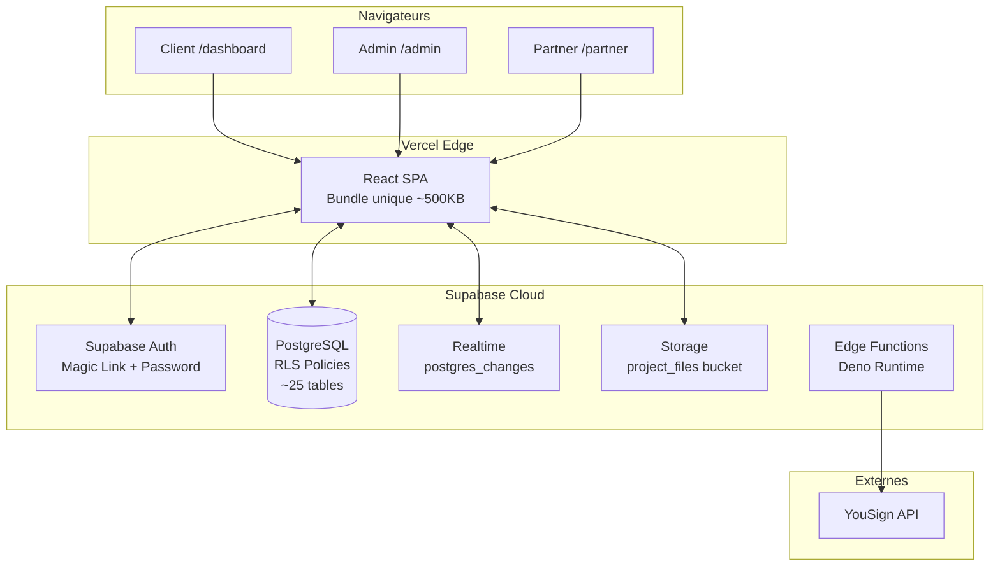
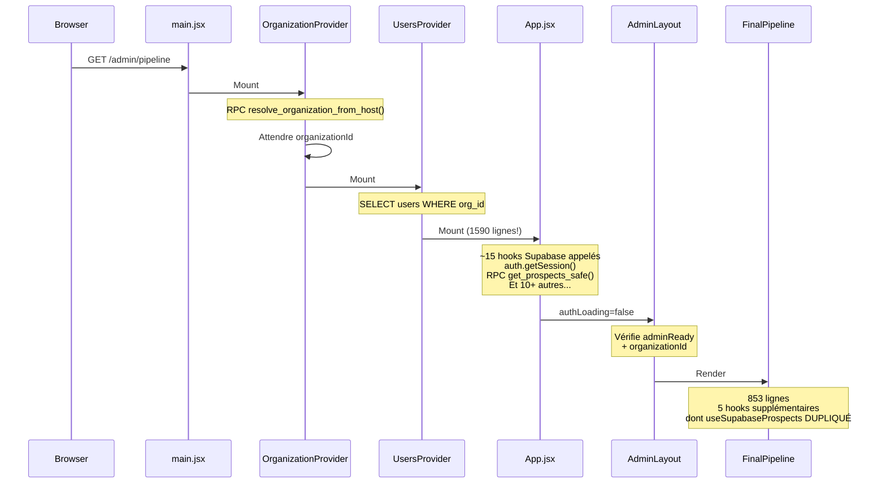
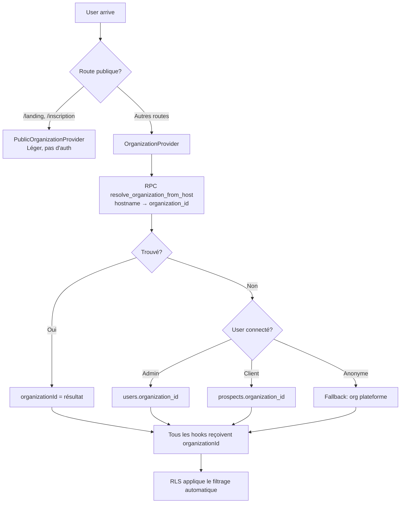

# 🧠 EVATIME CONTEXT PACK

> **Document pour LLM sans accès au code source**  
> **Date**: 24 janvier 2026  
> **Version**: 1.0

---

## 1) TL;DR (10 lignes)

**Evatime** est un CRM SaaS multitenant spécialisé dans la gestion de projets clients complexes (solaire, énergie, ACC). Dual-user : Admins (pipeline/CRM) + Clients (suivi projet). 

**Core concept**: Le **pipeline est une vue calculée** — jamais édité à la main. La vérité métier réside dans les **étapes de projet**. Quand une étape avance → le prospect change de colonne automatiquement.

**IA "Charly"** : exécutant encadré, pas décideur. Elle déclenche des actions (formulaires, signatures, messages) selon des **workflows déterministes** configurés par projet/étape.

**Problèmes majeurs** : Pages blanches fréquentes (erreurs non catchées), fichier `App.jsx` de 1600 lignes gérant tout le state, hooks Supabase dupliqués, re-renders massifs, waterfall de requêtes au démarrage. Pas de code splitting, pas d'observabilité.

**Objectif** : Scaler à 20 000 users, éliminer les pages blanches, unifier le rendu via un "Page Engine" déclaratif.

---

## 2) Architecture Map

### Stack Technique

| Couche | Technologie |
|--------|-------------|
| Frontend | React 18.2 + Vite 4.4 (SPA) |
| Styling | Tailwind CSS 3.3 + Radix UI primitives |
| State | Context API (`AppContext`) + 31 hooks Supabase |
| Routing | react-router-dom 6.16 (BrowserRouter) |
| Backend/BaaS | Supabase (PostgreSQL + Auth + Realtime + Edge Functions + Storage) |
| Animations | Framer Motion |
| Drag & Drop | @dnd-kit/core + @hello-pangea/dnd |
| PDF | pdf-lib, jspdf, pdfjs-dist |
| Signature | YouSign API (via Edge Function) |
| Déploiement | Vercel (frontend) + Supabase Cloud (backend) |

### Ce qui N'EXISTE PAS
- ❌ Cache Redis/Memcached
- ❌ Message queue (pas de jobs async côté serveur)
- ❌ Backend Node.js persistant (seulement Edge Functions serverless)
- ❌ GraphQL (tout est REST/RPC Supabase)
- ❌ Microservices (architecture monolithique frontend)

### Diagramme Macro



### Diagramme Flux Page (Pipeline Admin)



### Diagramme Flux Tenant



---

## 3) Domain Model (métier)

### Entités principales

#### **Organization** (Tenant)
- Représente une entreprise cliente d'Evatime (B2B SaaS)
- Toutes les données sont isolées par `organization_id`
- Chaque org a son branding (logo, couleurs) et son hostname

#### **User** (Admin/Commercial/Manager)
- Utilisateur PRO accédant à `/admin/*`
- Rôles hiérarchiques : `Global Admin > Manager > Commercial`
- Lié à `auth.users` via `user_id` (UUID)
- Possède des `access_rights` (JSONB) définissant quels modules et quels autres users il peut voir

#### **Prospect** (Contact/Client)
- Personne gérée dans le CRM
- Peut devenir **Client inscrit** si `user_id IS NOT NULL` (lié à auth.users)
- Appartient à un `owner_id` (le commercial qui le gère)
- Possède des `tags[]` = liste des projets auxquels il participe (ex: ["ACC", "Centrale"])
- `formData` (JSONB) = réponses aux formulaires soumis

#### **Project Template**
- Modèle de projet configurable (ACC, Centrale, Autonomie, Investissement...)
- Définit les **étapes** (steps) avec leur nom, icône, descriptions
- Chaque étape est mappée à une colonne du pipeline global

#### **Project Steps Status**
- Instance d'un projet pour un prospect donné
- Clé composite: `(prospect_id, project_type)`
- Contient l'état de chaque étape : `pending | in_progress | completed | blocked`

#### **Global Pipeline Steps**
- Colonnes du pipeline Kanban (MARKET, ÉTUDE, OFFRE, CONTRAT, CLIENT ACTIF...)
- Configurables par org
- Les prospects s'affichent dans la colonne correspondant à l'étape de leur projet le plus avancé

#### **Prompt** (Workflow Charly AI)
- Configuration d'actions automatiques par projet/étape
- Définit : message à envoyer, type d'action, formulaire à afficher, mode de gestion (auto/manuel), mode de vérification (none/human/ai)

#### **Form**
- Formulaire dynamique créé par l'admin
- Champs configurables (text, email, file, select...)
- Réutilisable dans plusieurs prompts

#### **Client Form Panel**
- Instance d'un formulaire envoyé à un client
- Statut : `pending → approved/rejected`

#### **Appointment**
- RDV unifié (type: physical, virtual, call, task)
- Lié à un prospect et un user assigné

#### **Chat Message**
- Messages échangés entre admin et client
- Contextualisés par `(prospect_id, project_type)`
- Peut contenir un formulaire, un fichier, un prompt

### Relations clés

```
Organization (1) ─────< (N) User
Organization (1) ─────< (N) Prospect
User (1) ─────< (N) Prospect (via owner_id)

Prospect (1) ─────< (N) Project Steps Status
Prospect (1) ─────< (N) Chat Message
Prospect (1) ─────< (N) Client Form Panel
Prospect (1) ─────< (N) Appointment

Project Template (1) ─────< (N) Project Steps Status
Project Template (1) ─────< (N) Prompt

Form (1) ─────< (N) Client Form Panel
```

### Règles métier critiques

1. **Pipeline = vue calculée** : La colonne d'un prospect est déterminée par l'étape `in_progress` de son projet le plus avancé. On ne drag-and-drop jamais directement.

2. **Avancement d'étape** : Quand une étape passe à `completed`, la suivante passe à `in_progress`. Cela peut déclencher des actions Charly automatiques.

3. **Auto-complétion** : Si `autoCompleteStep=true` dans le prompt et que le client soumet un formulaire avec `verificationMode=none`, l'étape se complète automatiquement.

4. **Vérification humaine** : Si `verificationMode=human`, une tâche est créée pour le commercial qui doit valider/rejeter avant passage à l'étape suivante.

5. **Isolation tenant** : Toutes les requêtes sont filtrées par `organization_id` via RLS. Un user d'une org ne voit jamais les données d'une autre.

6. **Ownership** : Un commercial ne peut modifier que ses propres prospects OU ceux partagés via `access_rights.users`.

---

## 4) Frontend

### Routing

**Fichier** : `src/App.jsx` (lignes 1480-1590)

**Structure** :
```
/ → Landing (page publique, organisation résolue depuis hostname)
/inscription/:slug? → RegistrationPage (création prospect)
/login → ProLoginPage (connexion admin)
/client-access → ClientAccessPage (connexion client magic link)

/admin → AdminLayout
  /admin → FinalPipeline (pipeline Kanban)
  /admin/pipeline → FinalPipeline
  /admin/agenda → Agenda (calendrier)
  /admin/contacts → CompleteOriginalContacts
  /admin/charly → CharlyPage
  /admin/profil → ProfilePage (3855 lignes!)
  /admin/configuration-ia → ConfigurationIA
  /admin/workflows-charly → WorkflowsCharlyPage
  /admin/projects-management → ProjectsManagementPage
  /admin/forms-management → FormsManagementPage
  /admin/contract-templates → ContractTemplatesPage
  /admin/partners → PartnersListPage

/dashboard → ClientLayout
  /dashboard → ClientDashboardPage
  /dashboard/parrainage → ParrainagePage
  /dashboard/offres → OffersPage
  /dashboard/profil → SettingsPage

/partner → PartnerLayout
  /partner/missions → PartnerMissionsPage

/platform → PlatformLayout (super-admin multi-org)
  /platform/organizations → OrganizationsListPage

/signature/:id → SignaturePage (signature électronique)
/sign/cosigner → CosignerSignaturePage
```

### Layout

**Fichiers** : `src/layouts/*.jsx`

**Composition** :
- `main.jsx` : Bootstrapping, décide entre PublicOrganizationProvider (routes publiques) et full providers (app)
- `OrganizationProvider` : Résout le tenant depuis hostname
- `UsersProvider` : Cache global des users admin
- `App.jsx` : Route matching + AppContext (state global)
- Layout spécifique : Header + Outlet + éventuellement Sidebar

**Problème** : Pas de composition déclarative. Chaque page gère ses propres états loading/error de manière hétérogène.

### State Management

**Server State** :
- 31 hooks `useSupabase*.js` dans `src/hooks/`
- Chaque hook : fetch initial + subscription Realtime
- Pattern : `useState + useEffect(fetch) + useEffect(subscribe)`
- Transformation snake_case → camelCase dans chaque hook

**UI State** :
- `AppContext` dans `App.jsx` : ~15 états (prospects, appointments, forms, prompts, currentUser, activeAdminUser...)
- États locaux dans chaque page/composant

**Problèmes** :
1. `AppContext` = God Context. Tout re-render quand un seul champ change.
2. Hooks dupliqués : `useSupabaseProspects` appelé dans App.jsx ET FinalPipeline.jsx ET Agenda.jsx
3. Pas de cache partagé (chaque appel = nouveau fetch)

### Data Fetching

**Pattern actuel** :
```javascript
// Pseudocode d'un hook Supabase typique
function useSupabaseProspects(activeAdminUser) {
  const [data, setData] = useState([])
  const [loading, setLoading] = useState(true)
  const [error, setError] = useState(null)
  
  useEffect(() => {
    if (!activeAdminUser) return
    fetchData()
  }, [activeAdminUser?.id])
  
  useEffect(() => {
    // Subscribe to Realtime changes
    const channel = supabase.channel('...')
      .on('postgres_changes', ..., handleChange)
      .subscribe()
    return () => supabase.removeChannel(channel)
  }, [activeAdminUser?.id])
  
  return { data, loading, error, mutate... }
}
```

**Problèmes** :
- Waterfall : ~7 requêtes séquentielles avant premier rendu utile
- Pas de retry automatique
- Pas de cache cross-hooks
- Pas de prefetching

### Modules (liste partielle)

| Module | Fichier | Où affiché |
|--------|---------|------------|
| Pipeline Kanban | `FinalPipeline.jsx` (853 lignes) | /admin |
| Prospect Details | `ProspectDetailsAdmin.jsx` (~2500 lignes) | Modal dans Pipeline |
| Agenda Calendar | `Agenda.jsx` (2032 lignes) | /admin/agenda |
| Chat Charly | `CharlyChat.jsx` | Sidebar dans ProspectDetails |
| Client Dashboard | `ClientDashboardPage.jsx` | /dashboard |
| Project Details | `ProjectDetails.jsx` | Dans ClientDashboard |
| Profile Admin | `ProfilePage.jsx` (3855 lignes!) | /admin/profil |
| Forms Management | `FormsManagementPage.jsx` | /admin/forms-management |

### Causes probables de pages blanches

| Symptôme | Zone de code | Cause |
|----------|--------------|-------|
| Écran blanc après login | `App.jsx` ligne 475-520 | Race condition auth : `authLoading` passe à false avant que `activeAdminUser` soit résolu |
| Spinner infini admin | `AdminLayout.jsx` ligne 35 | `organizationId` ne se résout jamais (hostname non mappé) |
| Crash sur sélection prospect | `FinalPipeline.jsx` ligne 650+ | `selectedProspect.name` sans optional chaining |
| Erreur silencieuse | `useSupabaseProspects.js` ligne 56 | `throw fetchError` sans ErrorBoundary module |
| Formulaire cassé | `ProspectDetailsAdmin.jsx` | Dépendance à `prompts` qui n'est pas encore chargé |

### 10 Conventions de code à respecter

1. **Toujours optional chaining** : `prospect?.name` jamais `prospect.name`
2. **Transformation snake_case ↔ camelCase** : Centraliser dans un fichier `transforms/`
3. **Un seul hook par donnée** : Pas de duplication `useSupabaseProspects` dans plusieurs composants
4. **États loading/empty/error explicites** : Chaque module doit gérer les 3 états
5. **ErrorBoundary par section** : Wrapper chaque module critique
6. **Pas de console.log en prod** : Utiliser `logger.debug/info/warn/error`
7. **Hooks au top level** : Jamais de hooks conditionnels (Rules of Hooks)
8. **useMemo pour listes filtrées** : Éviter les recalculs
9. **React.memo pour composants de liste** : `ProspectCard`, `EventCard`
10. **Pas d'effets de bord dans render** : Toute mutation dans useEffect ou handlers

---

## 5) Backend

### API Style

**Type** : Supabase REST + RPC (PostgreSQL functions)

**Endpoints critiques** :
- `POST /rest/v1/rpc/get_prospects_safe` : Liste prospects avec RLS bypass (sécurisé)
- `POST /rest/v1/rpc/update_prospect_safe` : Update prospect avec validation
- `POST /rest/v1/rpc/resolve_organization_from_host` : Résolution tenant

**Versioning** : Aucun (tout via Supabase auto-generated)

### Tenancy

**Résolution** :
1. Frontend appelle `resolve_organization_from_host(hostname)`
2. La RPC cherche dans `organization_domains` ou `organizations` table
3. Retourne `organization_id`
4. Toutes les requêtes suivantes incluent le contexte org (implicite via RLS ou explicite)

**Application** :
- RLS policies sur toutes les tables (`organization_id = get_current_org()`)
- Trigger auto-assigne `organization_id` sur INSERT
- Aucune donnée cross-org possible (isolation totale)

### Performance

**Endpoints critiques** :
- `get_prospects_safe` : Peut retourner 1000+ prospects. Pas de pagination côté DB.
- `appointments SELECT *` : Charge tous les RDV de l'org. Pas de filtre date côté DB.

**Patterns N+1** :
- Pas identifiés côté DB (Supabase gère bien les JOINs)
- Mais côté frontend : chaque prospect déclenche un fetch `project_steps_status` séparé

**Caching** :
- Aucun cache serveur
- Frontend : pas de cache client (chaque hook refetch)

### Jobs/Async

**Actuellement** : AUCUN job background côté serveur.

**Edge Functions existantes** :
- `generate-signed-pdf` : Génère PDF de contrat
- `invite-user` : Envoie email invitation
- `send-cosigner-invite` : Email co-signataire
- `yousign-create-signature` : Appel API YouSign
- `platform_create_organization` : Création org (admin plateforme)

**Problème** : Les actions longues (génération PDF, envoi emails) bloquent le frontend.

### Observabilité et Logs

**Actuellement** :
- `logger.js` : Wrapper console.log/warn/error
- En prod : `debug` et `info` désactivés
- Pas de Sentry ou équivalent
- Pas de traces distribuées
- Pas de métriques

**Ce qui manque** :
- Error tracking (Sentry)
- Performance monitoring (traces)
- Audit log structuré
- Metrics dashboard

---

## 6) Problèmes majeurs (Top 20)

### 1. 🔴 App.jsx = God Component (1590 lignes)

**Symptôme** : Toute modification risque une régression. Re-renders massifs.

**Cause** : Tout le state global dans un seul fichier/context.

**Fichier** : `src/App.jsx`

**Fix court terme** : Extraire en 4 contexts (Auth, Data, Config, UI).

**Fix long terme** : Page Engine déclaratif avec data contracts.

---

### 2. 🔴 Hooks Supabase dupliqués

**Symptôme** : Double fetch, double subscription Realtime.

**Cause** : `useSupabaseProspects` appelé dans App.jsx ET FinalPipeline.jsx.

**Fichiers** : `src/hooks/useSupabaseProspects.js`, `src/pages/admin/FinalPipeline.jsx`

**Fix court terme** : Supprimer les appels dupliqués, passer via context.

**Fix long terme** : Couche data centralisée avec cache partagé.

---

### 3. 🔴 Pas d'ErrorBoundary par module

**Symptôme** : Une erreur dans ProspectDetails = page blanche complète.

**Cause** : Un seul ErrorBoundary global dans `main.jsx`.

**Fichier** : `src/main.jsx`, `src/layouts/*.jsx`

**Fix court terme** : Ajouter ErrorBoundary dans chaque Layout.

**Fix long terme** : Chaque module a son propre boundary + retry.

---

### 4. 🔴 Race condition auth

**Symptôme** : Parfois page blanche après login.

**Cause** : `authLoading` passe à false avant résolution complète de `activeAdminUser`.

**Fichier** : `src/App.jsx` lignes 475-520

**Fix court terme** : Gate unifié `session && activeAdminUser`.

**Fix long terme** : Machine d'état auth explicite.

---

### 5. 🔴 Optional chaining manquant

**Symptôme** : `Cannot read property 'name' of null`.

**Cause** : `selectedProspect.name` sans `?.`.

**Fichiers** : `FinalPipeline.jsx`, `ProspectDetailsAdmin.jsx`, `Agenda.jsx`

**Fix court terme** : Audit + ajout systématique.

**Fix long terme** : TypeScript strict.

---

### 6. 🟡 ProfilePage = Monster Component (3855 lignes)

**Symptôme** : Impossible à maintenir, temps de chargement long.

**Cause** : Une seule page gère : profil, users, forms, prompts, templates, settings.

**Fichier** : `src/pages/admin/ProfilePage.jsx`

**Fix court terme** : Extraire chaque section en composant.

**Fix long terme** : Route par fonctionnalité (/admin/settings/users, /admin/settings/forms...).

---

### 7. 🟡 Agenda.jsx (2032 lignes)

**Symptôme** : Scroll lag, re-renders constants.

**Cause** : Fichier monolithique, pas de memoization.

**Fichier** : `src/pages/admin/Agenda.jsx`

**Fix court terme** : Extraire EventCard, CalendarGrid en composants memo.

**Fix long terme** : Virtualisation des événements.

---

### 8. 🟡 Waterfall de requêtes

**Symptôme** : 2-3s avant affichage utile.

**Cause** : 7+ requêtes séquentielles (org → auth → users → prospects → pipeline → templates → prompts...).

**Fichier** : `src/App.jsx`, `src/contexts/OrganizationContext.jsx`

**Fix court terme** : Paralléliser avec Promise.all.

**Fix long terme** : Prefetch intelligent, SSR partiel.

---

### 9. 🟡 Pas de code splitting

**Symptôme** : Bundle unique ~500KB.

**Cause** : Aucune configuration Vite pour chunks.

**Fichier** : `vite.config.js`

**Fix court terme** : `manualChunks` par route.

**Fix long terme** : Lazy loading systématique.

---

### 10. 🟡 Re-renders AppContext

**Symptôme** : Lag lors de la saisie.

**Cause** : Un seul context = tout re-render à chaque setState.

**Fichier** : `src/App.jsx`

**Fix court terme** : Split en contexts spécialisés.

**Fix long terme** : Zustand ou Jotai pour state granulaire.

---

### 11. 🟡 Console.log en production

**Symptôme** : Console polluée, fuite de données.

**Cause** : 150+ console.log non supprimés.

**Fichiers** : Partout

**Fix court terme** : Remplacer par `logger.debug`.

**Fix long terme** : Lint rule + pre-commit hook.

---

### 12. 🟡 Pas de retry sur erreurs réseau

**Symptôme** : Erreur unique = échec définitif.

**Cause** : Aucune logique de retry dans les hooks.

**Fichier** : `src/hooks/useSupabase*.js`

**Fix court terme** : Wrapper avec retry exponentiel.

**Fix long terme** : Bibliothèque (TanStack Query).

---

### 13. 🟡 Transformation snake_case dispersée

**Symptôme** : Incohérences `company_name` vs `companyName`.

**Cause** : Chaque hook fait sa propre transformation.

**Fichiers** : Tous les hooks

**Fix court terme** : Fichier `src/lib/transforms.js` centralisé.

**Fix long terme** : Types TypeScript cohérents.

---

### 14. 🟡 Spinner infini possible

**Symptôme** : Chargement sans fin sur routes admin.

**Cause** : `organizationId` ne se résout pas (hostname non mappé).

**Fichier** : `src/layouts/AdminLayout.jsx` ligne 35

**Fix court terme** : Timeout + message explicite.

**Fix long terme** : Fallback org par défaut.

---

### 15. 🟡 Pas de virtualisation des listes

**Symptôme** : Lag avec 500+ prospects.

**Cause** : Tous les DOM nodes rendus.

**Fichier** : `FinalPipeline.jsx`

**Fix court terme** : Limiter l'affichage à 100.

**Fix long terme** : `@tanstack/react-virtual`.

---

### 16. 🟡 Real-time subscriptions multiples

**Symptôme** : Mémoire/CPU élevés.

**Cause** : Chaque hook crée son propre channel.

**Fichiers** : Tous les hooks `useSupabase*.js`

**Fix court terme** : Canal partagé par table.

**Fix long terme** : Gestion centralisée des subscriptions.

---

### 17. 🟢 Pas d'audit log

**Symptôme** : Impossible de tracer qui a fait quoi.

**Cause** : Aucune table d'audit, aucun log structuré.

**Fix** : Table `action_audit_log` + logging dans les mutations.

---

### 18. 🟢 Pas de tests

**Symptôme** : Régressions fréquentes.

**Cause** : Aucun test unitaire/intégration.

**Fix** : Vitest + Testing Library pour composants critiques.

---

### 19. 🟢 Pas de TypeScript

**Symptôme** : Erreurs runtime évitables.

**Cause** : Tout en JavaScript.

**Fix long terme** : Migration progressive vers TypeScript.

---

### 20. 🟢 Documentation inline absente

**Symptôme** : Onboarding difficile.

**Cause** : Peu de JSDoc, pas de types.

**Fix** : Documenter les hooks et composants publics.

---

## 7) Plan "radical mais incrémental" (20 étapes)

### Phase 1: Fiabilité (Semaines 1-2)

| # | Action | Risque | Critère succès |
|---|--------|--------|----------------|
| 1 | Ajouter ErrorBoundary dans AdminLayout, ClientLayout | 🟢 Low | 0 page blanche sur erreur module |
| 2 | Audit optional chaining (FinalPipeline, Agenda, ProspectDetails) | 🟢 Low | 0 crash `null.property` |
| 3 | Unifier le gate auth dans App.jsx | 🟡 Med | Login → affichage < 3s sans flash |
| 4 | Ajouter retry (3x) sur hooks Supabase critiques | 🟢 Low | Resilience aux erreurs réseau |
| 5 | Intégrer Sentry pour error tracking | 🟢 Low | 100% erreurs JS capturées |

### Phase 2: Unification rendu (Semaines 3-5)

| # | Action | Risque | Critère succès |
|---|--------|--------|----------------|
| 6 | Splitter AppContext en 4 contexts | 🔴 High | Re-renders réduits 50% (Profiler) |
| 7 | Supprimer hooks dupliqués | 🟡 Med | 1 seul `useSupabaseProspects` call |
| 8 | Créer PageEngine MVP (types + composant) | 🟢 Low | Nouveau code, pas de breaking change |
| 9 | Migrer Pipeline vers PageEngine | 🟡 Med | Pipeline fonctionne identiquement |
| 10 | Migrer Dashboard vers PageEngine | 🟡 Med | Dashboard fonctionne identiquement |

### Phase 3: Performance (Semaines 6-7)

| # | Action | Risque | Critère succès |
|---|--------|--------|----------------|
| 11 | React.memo sur composants de liste | 🟢 Low | INP < 250ms |
| 12 | Virtualisation listes prospects | 🟡 Med | Fluide avec 1000+ prospects |
| 13 | Code splitting par route | 🟢 Low | Bundle initial < 200KB |
| 14 | Paralléliser requêtes initiales | 🟢 Low | LCP < 2.5s |

### Phase 4: IA Safe (Semaines 8-10)

| # | Action | Risque | Critère succès |
|---|--------|--------|----------------|
| 15 | Créer ActionRegistry MVP | 🟢 Low | 5 actions typées exécutables |
| 16 | Implémenter 15 actions catalogue | 🟢 Low | Couverture 80% use cases |
| 17 | Mode preview/diff | 🟢 Low | IA peut montrer sans exécuter |
| 18 | Table audit log + logging | 🟢 Low | 100% actions tracées |
| 19 | Mécanisme rollback | 🟡 Med | Rollback possible sur actions réversibles |
| 20 | Splitter ProfilePage en sous-routes | 🟡 Med | Fichier < 500 lignes |

---

## 8) IA Orchestratrice (Action Framework)

### 15 Actions candidates

| Action | Description | Données requises | Permission |
|--------|-------------|------------------|------------|
| `prospect.create` | Créer un prospect | name, email?, phone?, tags[] | Commercial+ |
| `prospect.update` | Modifier un prospect | prospectId, fields{} | Owner/Manager+ |
| `prospect.assignOwner` | Réassigner un prospect | prospectId, newOwnerId | Manager+ |
| `project.advanceStep` | Passer à l'étape suivante | prospectId, projectType | Commercial+ |
| `project.updateInfo` | Modifier infos projet | prospectId, projectType, data{} | Commercial+ |
| `appointment.create` | Créer un RDV | title, start, end, contactId | Commercial+ |
| `appointment.reschedule` | Reprogrammer un RDV | appointmentId, newStart, newEnd | Commercial+ |
| `task.create` | Créer une tâche | title, dueDate, contactId? | Commercial+ |
| `task.complete` | Marquer tâche terminée | taskId | Assignee |
| `chat.sendMessage` | Envoyer un message | prospectId, projectType, text | Commercial+ |
| `chat.sendForm` | Envoyer un formulaire | prospectId, projectType, formId | Commercial+ |
| `signature.initiate` | Lancer signature | prospectId, templateId, signers[] | Commercial+ |
| `form.validate` | Valider un formulaire soumis | formPanelId, status | Commercial+ |
| `notification.send` | Envoyer notification | userId, title, body | System |
| `user.create` | Créer un utilisateur | name, email, role | Admin+ |

### Permissions (matrice)

```
                        Commercial  Manager  GlobalAdmin
prospect.create            ✅         ✅        ✅
prospect.update (own)      ✅         ✅        ✅
prospect.update (team)     ❌         ✅        ✅
prospect.assignOwner       ❌         ✅        ✅
project.advanceStep        ✅         ✅        ✅
appointment.create         ✅         ✅        ✅
task.create                ✅         ✅        ✅
signature.initiate         ✅         ✅        ✅
user.create                ❌         ❌        ✅
```

### Mode draft/preview/rollback

**Preview** :
```
IA : "Je vais créer un prospect 'Jean Dupont' avec tag ACC"
→ Action en mode preview
→ Affiche le diff sans exécuter
→ User confirme ou annule
```

**Rollback** :
- Chaque action log `before_state` + `after_state`
- Rollback = réappliquer `before_state`
- Actions irréversibles (ex: email envoyé) = pas de rollback

### Audit Trail

Table `action_audit_log` :
```
id, action_name, params, before_state, after_state,
user_id, organization_id, triggered_by (user|automation|ai),
ip_address, user_agent, created_at
```

Rétention : 7 ans (légal), PII hashé après 90 jours.

### PII

**Règles** :
- Jamais de PII dans les logs debug
- PII hashé dans audit après 90 jours
- Export RGPD : fonction dédiée pour extraire données client

**Champs PII** : email, phone, address, iban, nom complet

---

## Fichiers clés à lire en premier (40 fichiers)

### Entry Points
| Fichier | Rôle |
|---------|------|
| `src/main.jsx` | Bootstrapping React, providers racine |
| `src/App.jsx` | Routing + AppContext (1590 lignes, cœur du problème) |
| `vite.config.js` | Configuration build |

### Contexts
| Fichier | Rôle |
|---------|------|
| `src/contexts/OrganizationContext.jsx` | Résolution tenant depuis hostname |
| `src/contexts/UsersContext.jsx` | Cache global des users admin |
| `src/contexts/PublicOrganizationContext.jsx` | Version légère pour routes publiques |

### Layouts
| Fichier | Rôle |
|---------|------|
| `src/layouts/AdminLayout.jsx` | Layout espace admin |
| `src/layouts/ClientLayout.jsx` | Layout espace client |
| `src/layouts/PartnerLayout.jsx` | Layout espace partenaire |

### Pages critiques
| Fichier | Rôle |
|---------|------|
| `src/pages/admin/FinalPipeline.jsx` | Pipeline Kanban (853 lignes) |
| `src/pages/admin/Agenda.jsx` | Calendrier (2032 lignes) |
| `src/pages/admin/ProfilePage.jsx` | Profil admin (3855 lignes!) |
| `src/pages/client/ClientDashboardPage.jsx` | Dashboard client |
| `src/pages/landing.jsx` | Landing page publique |
| `src/pages/RegistrationPage.jsx` | Inscription prospect |

### Composants clés
| Fichier | Rôle |
|---------|------|
| `src/components/admin/ProspectDetailsAdmin.jsx` | Fiche prospect détaillée (~2500 lignes) |
| `src/components/admin/CharlyChat.jsx` | Chat IA dans fiche prospect |
| `src/components/admin/ProspectCard.jsx` | Card dans le pipeline |
| `src/components/ProjectDetails.jsx` | Détail projet côté client |
| `src/components/ErrorBoundary.jsx` | Gestion erreurs React |

### Hooks Supabase
| Fichier | Rôle |
|---------|------|
| `src/hooks/useSupabaseProspects.js` | CRUD + realtime prospects |
| `src/hooks/useSupabaseAgenda.js` | CRUD + realtime appointments |
| `src/hooks/useSupabaseUsers.js` | Liste users admin |
| `src/hooks/useSupabaseGlobalPipeline.js` | Colonnes pipeline |
| `src/hooks/useSupabaseProjectStepsStatus.js` | État des étapes projet |
| `src/hooks/useSupabaseChatMessages.js` | Messages chat |
| `src/hooks/useSupabaseNotifications.js` | Notifications admin |
| `src/hooks/useSupabaseClientFormPanels.js` | Formulaires envoyés aux clients |
| `src/hooks/useSupabaseProjectTemplates.js` | Templates de projets |
| `src/hooks/useSupabaseForms.js` | Formulaires dynamiques |
| `src/hooks/useSupabasePrompts.js` | Prompts Charly AI |

### Workflow/IA
| Fichier | Rôle |
|---------|------|
| `src/hooks/useWorkflowExecutor.js` | Exécution auto des actions workflow |
| `src/hooks/useAutoCreateTasks.js` | Création auto de tâches |
| `src/hooks/useWorkflowActionTrigger.js` | Déclenchement séquentiel actions |

### Lib
| Fichier | Rôle |
|---------|------|
| `src/lib/supabase.js` | Client Supabase configuré |
| `src/lib/logger.js` | Logger (console wrapper) |
| `src/lib/utils.js` | Utilitaires (cn, slugify...) |
| `src/lib/contractPdfGenerator.js` | Génération PDF contrats |

### Database
| Fichier | Rôle |
|---------|------|
| `supabase/schema.sql` | Schéma complet (1597 lignes) |
| `supabase/AUTH_LOGIC.md` | Doc auth admin vs client |
| `supabase/PROMPTS_AND_AUTOMATION.md` | Doc système prompts |

### Documentation
| Fichier | Rôle |
|---------|------|
| `PROJECT_GUIDE.md` | Philosophie Evatime |
| `FONCTIONNEMENT_ACTUEL_LOCASUN.md` | Workflow détaillé |
| `SOFTWARE_OVERVIEW.md` | Vue fonctionnelle |
| `BUGS_ET_PROBLEMES_REELS.md` | Problèmes identifiés |
| `.github/copilot-instructions.md` | Règles pour Copilot |

---

## 6) Pricing & Charge EVATIME

> **Système interne** — Visible uniquement par les Platform Admins (`/platform/*`)

### 6.1 Colonnes `organizations`

| Colonne | Type | Rôle |
|---------|------|------|
| `pricing_plan` | TEXT | Formule commerciale (ex: "Starter", "Pro", "Enterprise") |
| `monthly_price_reference` | INTEGER | Prix mensuel HT en euros (référence interne) |
| `evatime_load_score` | INTEGER | Score brut calculé automatiquement |
| `evatime_load_estimated` | INTEGER | Niveau de charge (0-3) déduit du score |

⚠️ Ces colonnes sont **strictement internes** — Aucune organisation cliente n'y a accès.

### 6.2 Charge EVATIME (calcul automatique)

La charge est calculée automatiquement via la RPC `platform_calculate_evatime_load(org_id)`.

**Facteurs pris en compte :**
- Nombre d'utilisateurs
- Nombre de prospects
- Nombre de projets actifs
- Formulaires en attente
- Fichiers stockés
- Activité récente (dernier mois)

**Formule indicative :**
```
score = users_count × 2 + prospects_count + forms_pending × 5
```

Aucun input humain requis — le calcul est déclenché à la demande.

### 6.3 Niveaux de charge

| Score | Niveau | Label | Couleur |
|-------|--------|-------|---------|
| 0-10 | 0 | Léger | 🟢 Vert |
| 11-30 | 1 | Normal | 🟡 Jaune |
| 31-60 | 2 | Complexe | 🟠 Orange |
| 61+ | 3 | Critique | 🔴 Rouge |

### 6.4 Prix recommandé (indicatif)

Le système suggère un prix basé sur le niveau de charge :

| Niveau | Prix recommandé |
|--------|-----------------|
| 0 (Léger) | 490 € |
| 1 (Normal) | 1 500 € |
| 2 (Complexe) | 3 000 € |
| 3 (Critique) | Sur engagement |

⚠️ **Lecture seule** — Le système ne modifie jamais le prix réel. La décision reste humaine.

### 6.5 Alertes pricing

Deux types d'alertes affichées sur le dashboard Platform :

| Alerte | Condition | Rôle |
|--------|-----------|------|
| **Opportunités d'augmentation** | `prix_actuel < prix_recommandé` | Signale un sous-pricing potentiel |
| **Clients à risque** | `prix_actuel > prix_recommandé` | Signale une valeur perçue faible |

Ces alertes sont **purement indicatives** — Aucune action automatique.

### 6.6 RPCs Platform

| RPC | Rôle |
|-----|------|
| `platform_calculate_evatime_load(org_id)` | Calcule et stocke score + niveau de charge |
| `platform_get_home_kpis()` | Retourne KPIs globaux (orgs actives, suspendues, revenu) |
| `platform_update_org_pricing(org_id, plan, price)` | Met à jour pricing_plan et monthly_price_reference |
| `platform_get_organization_detail(org_id)` | Retourne détail org incluant pricing et charge |

Toutes ces RPCs sont protégées par `is_platform_admin()`.

### 6.7 Principe fondamental

> **EVATIME observe, EVATIME n'impose jamais.**

- Le système **calcule** des indicateurs
- Le système **affiche** des recommandations
- Le système **ne décide pas** à la place de l'humain
- Toute action commerciale reste une **décision explicite**

---

**FIN DU CONTEXT PACK**
