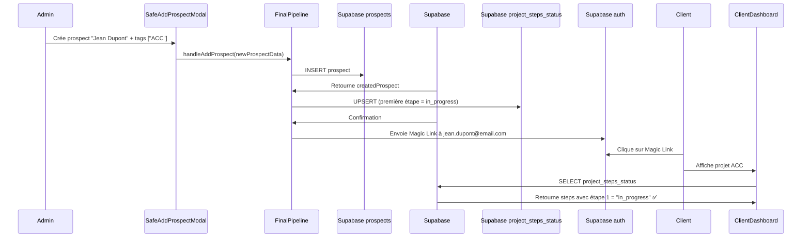

# 🔧 FIX: Initialisation des étapes lors de la création prospect par admin

## 🐛 Problème identifié

Lorsqu'un admin crée un prospect avec des projets (tags) depuis **Pipeline** ou **Contacts**, les entrées `project_steps_status` ne sont **pas créées**. Résultat :
- La première étape reste en "pending" au lieu de "in_progress"
- Le client ne voit pas son projet en cours après connexion via Magic Link

## 🔍 Cause racine

### Trois flux de création de prospects existaient :

1. ✅ **Client s'inscrit** (RegistrationPage.jsx) : Initialise correctement les steps (lignes 184-207)
2. ✅ **Client ajoute un projet** (App.jsx addProject) : Initialise correctement les steps (lignes 1182-1187)
3. ❌ **Admin crée un prospect** (FinalPipeline.jsx / CompleteOriginalContacts.jsx) : **N'initialise PAS les steps**

Dans `handleAddProspect`, le code appelait `addSupabaseProspect()` mais ne créait jamais les entrées dans `project_steps_status`.

## ✅ Solution appliquée

### 1️⃣ Modification de `handleAddProspect` (FinalPipeline.jsx, lignes 542-586)

```javascript
const handleAddProspect = async (newProspectData) => {
  try {
    const firstStepId = globalPipelineSteps[0]?.step_id || globalPipelineSteps[0]?.id;
    
    const createdProspect = await addSupabaseProspectDirect({ 
      ...newProspectData, 
      status: firstStepId,
      ownerId: activeAdminUser?.id
    });

    // 🔥 NOUVEAU : Initialiser project_steps_status pour chaque projet
    if (createdProspect && newProspectData.tags && newProspectData.tags.length > 0) {
      for (const projectType of newProspectData.tags) {
        const defaultSteps = projectsData[projectType]?.steps;
        if (defaultSteps && defaultSteps.length > 0) {
          try {
            const initialSteps = JSON.parse(JSON.stringify(defaultSteps));
            initialSteps[0].status = 'in_progress'; // ✅ Première étape active
            
            await supabase
              .from('project_steps_status')
              .upsert({
                prospect_id: createdProspect.id,
                project_type: projectType,
                steps: initialSteps,
                updated_at: new Date().toISOString()
              }, {
                onConflict: 'prospect_id,project_type'
              });
          } catch (err) {
            logger.error('Erreur initialisation steps', { projectType, error: err });
          }
        }
      }
    }

    setIsAddModalOpen(false);
  } catch (error) {
    // Gestion d'erreur...
  }
};
```

### 2️⃣ Modification identique dans `CompleteOriginalContacts.jsx` (lignes 434-478)

Même logique appliquée avec `addSupabaseProspect()` au lieu de `addSupabaseProspectDirect()`.

### 3️⃣ Ajout de l'import `logger` dans `CompleteOriginalContacts.jsx`

```javascript
import { logger } from '@/lib/logger';
```

## 🎯 Flux de données après le fix



## 🧪 Test de validation

### Scénario de test :

1. **Admin** se connecte à `/admin/pipeline` ou `/admin/contacts`
2. **Admin** clique sur "Ajouter un prospect"
3. **Admin** remplit le formulaire (nom, email, téléphone)
4. **Admin** coche un ou plusieurs projets (ACC, Centrale, etc.)
5. **Admin** clique sur "Créer le prospect"

### Résultat attendu :

- ✅ Prospect créé dans `prospects` avec tags
- ✅ Magic Link envoyé à l'email du prospect
- ✅ Entrées créées dans `project_steps_status` avec première étape = `in_progress`
- ✅ Quand le client se connecte, il voit **"En cours"** sur la première étape de ses projets

### Validation SQL :

```sql
-- Vérifier qu'un prospect créé par admin a bien ses steps initialisés
SELECT 
  p.name, 
  p.tags, 
  pss.project_type, 
  pss.steps->0->>'status' as first_step_status
FROM prospects p
LEFT JOIN project_steps_status pss ON p.id = pss.prospect_id
WHERE p.email = 'test@example.com';
```

**Résultat attendu** : `first_step_status = 'in_progress'` pour chaque projet du prospect

## 📂 Fichiers modifiés

1. **`src/pages/admin/FinalPipeline.jsx`** (lignes 542-586)
   - Fonction `handleAddProspect()` rendue plus complète
   - Ajout de la boucle d'initialisation des steps

2. **`src/pages/admin/CompleteOriginalContacts.jsx`** (lignes 434-478)
   - Fonction `handleAddProspect()` rendue plus complète
   - Ajout de l'import `logger`
   - Ajout de la boucle d'initialisation des steps

## 📊 Comparaison avant/après

| Flux de création | AVANT (steps initialisés ?) | APRÈS (steps initialisés ?) |
|------------------|-----------------------------|-----------------------------|
| Client inscription | ✅ Oui | ✅ Oui |
| Client ajoute projet | ✅ Oui | ✅ Oui |
| Admin crée prospect | ❌ **NON** | ✅ **OUI** |

## 🔗 Références

- **Documentation** : `supabase/DYNAMIC_FORMS_SYSTEM.md` (sections sur project_steps_status)
- **Fichier similaire** : `FIX_CLIENT_ADD_PROJECT_FIRST_STEP.md` (client ajoute projet)
- **Fichier similaire** : `FIX_PROJECT_STEPS_INITIALIZATION.md` (admin ajoute projet à prospect existant)
- **Code de référence** : `RegistrationPage.jsx` lignes 184-207 (logique source)

---

**Date du fix** : 11 décembre 2025  
**Testé sur** : Environnement de développement  
**Status** : ✅ Corrigé et documenté
