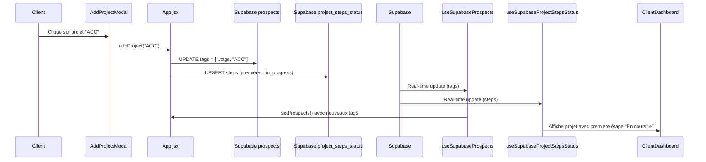

# 🔧 FIX: Ajout projet client - Initialisation première étape

## 🐛 Problème identifié

Lorsqu'un **client** ajoutait un nouveau projet via `AddProjectModal`, la fonction `addProject()` dans `App.jsx` avait un **bug critique** :

### ❌ Comportement AVANT le fix

```javascript
// App.jsx - addProject() (AVANT)
const addProject = (projectType) => {
  // ❌ PROBLÈME: Met à jour le state LOCAL mais pas Supabase !
  setProspects(prevProspects => {
    const updatedProspects = prevProspects.map(prospect => {
      if (prospect.id === currentUser.id) {
        const newTags = [...prospect.tags, projectType]; // ❌ Seulement en mémoire
        return { ...prospect, tags: newTags };
      }
      return prospect;
    });
    return updatedProspects;
  });
  
  // ✅ Initialise bien les steps avec in_progress
  const newSteps = JSON.parse(JSON.stringify(defaultSteps));
  newSteps[0].status = 'in_progress';
  updateProjectSteps(currentUser.id, projectType, newSteps);
}
```

**Symptômes** :
- ✅ **Steps** enregistrés dans Supabase avec première étape en "in_progress"
- ❌ **Tags** UNIQUEMENT en mémoire (state local React)
- ❌ Après rafraîchissement de la page → projet disparu (tags pas en base)
- ⚠️ Désynchronisation entre real-time et state local

---

## ✅ Solution appliquée

### 1️⃣ Modification de `addProject()` dans App.jsx

```javascript
// App.jsx - addProject() (APRÈS)
const addProject = async (projectType) => {  // ✅ Maintenant async
  if (userProjects.includes(projectType)) {
    return false;
  }
  const updatedProjects = [...userProjects, projectType];
  setUserProjects(updatedProjects);

  if (currentUser) {
    // 🔥 FIX: Sauvegarder les tags dans Supabase (pas seulement en mémoire)
    const updatedTags = [...(currentUser.tags || []), projectType];
    
    try {
      // ✅ Mise à jour via RPC update_prospect_safe()
      await updateProspect({
        id: currentUser.id,
        tags: updatedTags,
      });
      
      logger.debug('✅ Tags updated in Supabase', { projectType, updatedTags });
    } catch (error) {
      logger.error('❌ Failed to update tags in Supabase', error);
      toast({
        title: "Erreur",
        description: "Impossible d'ajouter le projet. Veuillez réessayer.",
        variant: "destructive",
      });
      return false;
    }

    // ✅ Initialiser les étapes avec première étape en "in_progress"
    const defaultSteps = projectsData[projectType]?.steps;
    if (defaultSteps && defaultSteps.length > 0) {
      const newSteps = JSON.parse(JSON.stringify(defaultSteps));
      newSteps[0].status = 'in_progress';
      updateProjectSteps(currentUser.id, projectType, newSteps);
    }
  }

  return true;
};
```

### 2️⃣ Modification de `AddProjectModal.jsx`

```javascript
// AddProjectModal.jsx - handleProjectTypeClick() (APRÈS)
const handleProjectTypeClick = async (projectType, projectTitle) => {  // ✅ async
  const success = await addProject(projectType);  // ✅ await
  if (success) {
    toast({
      title: "Projet ajouté avec succès ! ✅",
      description: `Le projet "${projectTitle}" est maintenant dans votre tableau de bord.`,
    });
    onClose();
    navigate('/dashboard');
  } else {
    toast({
      title: "Projet déjà existant",
      description: "Ce projet est déjà dans votre tableau de bord.",
      variant: "destructive"
    });
  }
};
```

---

## 🎯 Flux de données après le fix



---

## 📋 Tables Supabase concernées

### `prospects`
```sql
id       | tags             | email
---------|------------------|------------------
uuid-123 | ['ACC']          | client@test.com
```

### `project_steps_status`
```sql
prospect_id | project_type | steps                                  | created_at
------------|--------------|----------------------------------------|------------
uuid-123    | ACC          | [{name: "Inscription", status: "in_... | 2025-12-11
```

**Contrainte unique** : `(prospect_id, project_type)`  
**Opération** : `UPSERT` (insert or update)

---

## 🎯 Scénarios d'ajout de projet (tous corrigés)

| Scénario | Composant | Tags Supabase | Steps Supabase | Status |
|----------|-----------|---------------|----------------|--------|
| Admin ajoute projet | `ProspectDetailsAdmin.jsx` | ✅ Via onUpdate() | ✅ Via updateSupabaseSteps() | ✅ OK |
| Client via `/offers` | `OffersPage.jsx` | ✅ Via updateProspect() | ✅ Direct upsert | ✅ OK |
| Client via modal | `AddProjectModal.jsx` | ✅ Via updateProspect() | ✅ Via updateProjectSteps() | ✅ FIXÉ |

### Vérification du flux complet

```javascript
// ✅ TOUS LES CHEMINS maintenant:
// 1. Ajoutent les tags dans prospects.tags
// 2. Initialisent les steps avec première étape "in_progress"
// 3. Sauvegardent dans project_steps_status
// 4. Déclenchent le real-time vers tous les composants
```

---

## 🧪 Test de validation

### Script SQL de vérification

Utiliser le fichier `check_client_add_project_steps.sql` :

```sql
-- Voir si première étape = "in_progress"
SELECT 
  p.email,
  pss.project_type,
  pss.steps->0->>'name' AS first_step,
  pss.steps->0->>'status' AS status,
  CASE 
    WHEN pss.steps->0->>'status' = 'in_progress' THEN '✅ OK'
    ELSE '❌ PROBLÈME'
  END AS validation
FROM project_steps_status pss
JOIN prospects p ON p.id = pss.prospect_id
ORDER BY pss.created_at DESC
LIMIT 20;
```

### Procédure de test

1. Connexion client sur `/dashboard`
2. Cliquer sur "Ajouter un projet"
3. Sélectionner un projet (ex: "ACC")
4. Vérifier que le projet apparaît avec première étape "En cours"
5. Rafraîchir la page → le projet doit toujours être là ✅
6. Vérifier dans Supabase SQL Editor :
   - `prospects.tags` contient le nouveau projet
   - `project_steps_status` existe avec première étape `in_progress`

---

## 🔍 Différences entre les 3 chemins

| Méthode | Tags | Steps | RPC/Direct |
|---------|------|-------|------------|
| **Admin** | Via `onUpdate()` → RPC | Via hook `updateSupabaseSteps()` | RPC update_prospect_safe |
| **Client (Offers)** | Via `updateProspect()` → RPC | Direct `supabase.from().upsert()` | RPC update_prospect_safe |
| **Client (Modal)** | Via `updateProspect()` → RPC | Via `updateProjectSteps()` → direct | RPC update_prospect_safe |

**Point clé** : Tous utilisent maintenant `updateProspect()` pour les tags → garantit RLS et validation ✅

---

## ⚠️ Pièges évités

### Avant le fix
- ❌ Tags en mémoire → perdus au refresh
- ❌ Désynchronisation entre state React et Supabase
- ❌ Real-time ne se déclenche pas (pas de UPDATE en base)
- ❌ Client ne voit pas son projet après rafraîchissement

### Après le fix
- ✅ Tags persistés dans Supabase
- ✅ Real-time synchronise automatiquement tous les composants
- ✅ Projet visible même après rafraîchissement
- ✅ Cohérence entre admin et client

---

## 📂 Fichiers modifiés

1. **`src/App.jsx`** (ligne 1155-1191)
   - Fonction `addProject()` rendue `async`
   - Ajout de `await updateProspect()` pour sauvegarder tags
   - Gestion d'erreur avec toast

2. **`src/components/AddProjectModal.jsx`** (ligne 22-39)
   - Fonction `handleProjectTypeClick()` rendue `async`
   - Ajout de `await` devant `addProject()`

3. **Nouveau fichier** : `check_client_add_project_steps.sql`
   - Script de validation SQL

---

**Date du fix** : 11 décembre 2025  
**Testé sur** : Environnement de développement  
**Status** : ✅ Corrigé et documenté
