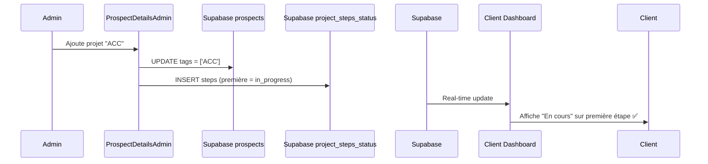

# 🔧 FIX: Initialisation des étapes de projet (Admin → Client)

## 🐛 Problème identifié

Lorsqu'un admin ajoutait un nouveau projet à un prospect via `ProspectDetailsAdmin.jsx`, les étapes n'étaient pas initialisées dans Supabase immédiatement. Cela causait une désynchronisation :

### Symptômes
- ✅ **Côté Admin** : La première étape apparaissait en "En cours" (in_progress)
- ❌ **Côté Client** : Toutes les étapes apparaissaient en "À venir" (pending)
- ⚠️ Il fallait **cliquer à nouveau sur "En cours"** côté admin pour forcer la synchronisation

## 🔍 Cause racine

Dans `src/components/admin/ProspectDetailsAdmin.jsx`, la fonction `handleAddProject()` :

```javascript
// ❌ AVANT
const handleAddProject = (projectType) => {
  // Met à jour les tags du prospect
  onUpdate(updatedProspect);
  // Mais ne crée PAS l'entrée dans project_steps_status
}
```

**Conséquence** :
1. L'admin voit les steps via `getProjectSteps()` qui les met en mémoire (sans Supabase)
2. Le client interroge directement Supabase → rien trouvé → template par défaut (pending)

## ✅ Solution appliquée

### 1️⃣ Modification de `handleAddProject` (ProspectDetailsAdmin.jsx)

```javascript
// ✅ APRÈS
const handleAddProject = async (projectType) => {
  const currentTags = prospect.tags || [];
  if (!currentTags.includes(projectType)) {
    // ... mise à jour des tags ...
    
    // 🔥 NOUVEAU : Initialiser les étapes dans Supabase
    const defaultSteps = projectsData[projectType]?.steps;
    if (defaultSteps && defaultSteps.length > 0) {
      try {
        const initialSteps = JSON.parse(JSON.stringify(defaultSteps));
        initialSteps[0].status = 'in_progress'; // Première étape active
        
        // Sauvegarder immédiatement dans Supabase
        await updateSupabaseSteps(projectType, initialSteps);
        
        console.log('✅ Étapes initialisées dans Supabase pour', projectType);
      } catch (error) {
        console.error('❌ Erreur initialisation steps:', error);
      }
    }
    
    toast({
      title: "✅ Projet ajouté !",
      description: `Le projet ${projectsData[projectType]?.title} a été associé au prospect.`,
    });
  }
  setShowAddProjectModal(false);
};
```

### 2️⃣ Flux de données après le fix



## 🧪 Test de validation

### Scénario de test
1. **Admin** : Ouvrir fiche prospect sans projet
2. **Admin** : Cliquer "Ajouter un projet" → Sélectionner "ACC"
3. **Admin** : Vérifier que la première étape est en "En cours"
4. **Client** : Se connecter avec ce compte
5. **Client** : Vérifier que la première étape est également en "En cours" ✅

### Comportement attendu
- ✅ Les deux côtés (admin et client) affichent immédiatement le même statut
- ✅ Pas besoin de recliquer sur "En cours" côté admin
- ✅ Real-time synchronisé entre tous les utilisateurs

## 📋 Tables Supabase concernées

### `project_steps_status`
```sql
prospect_id | project_type | steps                                  | created_at
------------|--------------|----------------------------------------|------------
uuid-123    | ACC          | [{name: "Inscription", status: "in_... | 2025-11-25
```

**Contrainte unique** : `(prospect_id, project_type)`
**Opération** : `UPSERT` (insert or update)

## 🔗 Fichiers modifiés

### 1️⃣ `src/components/admin/ProspectDetailsAdmin.jsx` (ligne ~1023)
- Fonction `handleAddProject()` → maintenant `async`
- Ajout de l'initialisation Supabase pour les projets ajoutés par l'admin

### 2️⃣ `src/pages/client/OffersPage.jsx` (ligne ~93)
- Fonction `handleCtaClick()` → ajout de l'initialisation des steps
- Corrige le cas où le client ajoute un projet depuis la page `/offers`

## 📝 Notes importantes

### Fonction `addProject` dans App.jsx
Cette fonction est utilisée par `AddProjectModal.jsx` (ancien composant). Elle sauvegarde déjà dans Supabase via `updateProjectSteps()`, donc ✅ **pas de modification nécessaire**.

### Deux chemins d'ajout de projet côté client
1. **`AddProjectModal.jsx`** → Utilise `addProject()` → ✅ Déjà correct
2. **`OffersPage.jsx`** → Ajout direct via Supabase → ✅ Maintenant corrigé

### Hook `useSupabaseProjectStepsStatus`
Le hook gère déjà le real-time correctement via :
```javascript
.channel(`project-steps-${prospectId}`)
.on('postgres_changes', ...)
```

## ✨ Bénéfices

1. **Synchronisation immédiate** : Plus besoin de double-clic
2. **Expérience utilisateur cohérente** : Admin et client voient la même chose
3. **Fiabilité** : Une seule source de vérité (Supabase)
4. **Real-time** : Tous les admins voient les changements instantanément

## 🎯 Scénarios d'ajout de projet (tous corrigés)

| Scénario | Composant | Avant | Après |
|----------|-----------|-------|-------|
| Admin ajoute projet | `ProspectDetailsAdmin.jsx` | ❌ Steps non initialisés | ✅ Steps in_progress en DB |
| Client via `/offers` | `OffersPage.jsx` | ❌ Steps non initialisés | ✅ Steps in_progress en DB |
| Client via modal | `AddProjectModal.jsx` | ✅ Déjà fonctionnel | ✅ Pas de changement |

### Vérification du flux complet

```javascript
// ✅ TOUS LES CHEMINS maintenant:
// 1. Ajoutent les tags dans prospects
// 2. Initialisent les steps avec première étape "in_progress"
// 3. Sauvegardent dans project_steps_status
// 4. Déclenchent le real-time vers tous les clients connectés
```

---

**Date du fix** : 25 novembre 2025  
**Testé sur** : Environnement de développement  
**Status** : ✅ Résolu (3 scénarios couverts)
